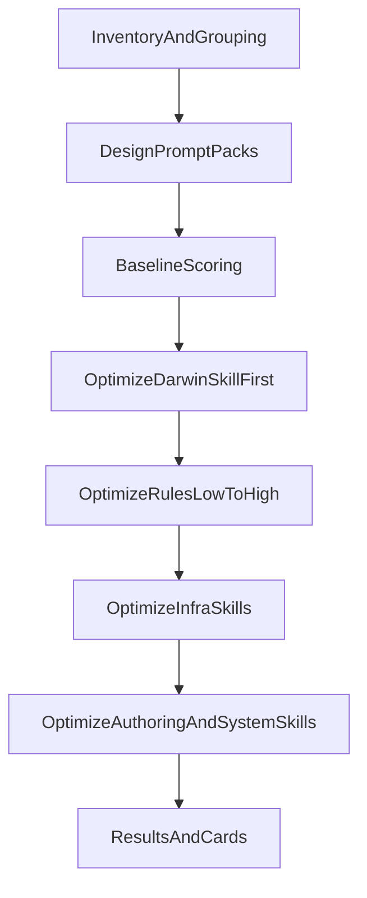

# Darwin 批量优化计划

## 范围

- 本次目标共 `21` 个资产：
  - `6` 个基础 skills：
  [`C:\Users\016551\.cursor\skills](C:\Users\016551.cursor\skills)`
  - `5` 个 Cursor 辅助 skills：
  [`C:\Users\016551\.cursor\skills-cursor](C:\Users\016551.cursor\skills-cursor)`
  - `4` 个 Codex system skills：
  [`C:\Users\016551\.codex\skills\.system](C:\Users\016551.codex\skills.system)`
  - `5` 条用户级 rules：
  [`C:\Users\016551\.cursor\rules](C:\Users\016551.cursor\rules)`
  - `1` 条工作区 rule：
  [`C:\Users\016551\OneDrive\Desktop\科技树\_系统工具\.cursor\rules\file-sync.mdc](C:\Users\016551\OneDrive\Desktop\科技树_系统工具.cursor\rules\file-sync.mdc)`
- 明确排除插件缓存里的 rule 副本。
- 现状已知缺口：所有 skill / rule 旁边都还没有 `test-prompts.json`，也没有现成 `results.tsv`，所以 Darwin 流程要先补齐基线材料。

## 关键依赖

- 先读并维护元流程文件 
[`C:\Users\016551\.cursor\skills\darwin-skill\SKILL.md](C:\Users\016551.cursor\skills\darwin-skill\SKILL.md)`，因为后续所有优化都要沿用它的 rubric 与 ratchet 机制。
- 
[`C:\Users\016551\.cursor\skills\file-sync\SKILL.md](C:\Users\016551.cursor\skills\file-sync\SKILL.md)` 明确委托 
[`C:\Users\016551\.cursor\skills\md-cleanup\SKILL.md](C:\Users\016551.cursor\skills\md-cleanup\SKILL.md)`，这两个要相邻优化并做联测。
- 
[`C:\Users\016551\.cursor\rules\content-integrity.mdc](C:\Users\016551.cursor\rules\content-integrity.mdc)` 直接引用 
[`C:\Users\016551\.cursor\rules\writing-quality.mdc](C:\Users\016551.cursor\rules\writing-quality.mdc)`；
[`C:\Users\016551\.cursor\rules\work-in-layers.mdc](C:\Users\016551.cursor\rules\work-in-layers.mdc)` 又和 
[`C:\Users\016551\.cursor\skills\pua-motivator\SKILL.md](C:\Users\016551.cursor\skills\pua-motivator\SKILL.md)` 有分工关系，所以 rules 不能只做单文件优化，还要做一次体系级回归检查。

## 执行顺序

### Phase 0：初始化与回滚策略

- 执行开始时先分别验证 `.cursor`、`.codex`、工作区规则根目录的 git 状态。
- 若某一根目录不是 git 仓库，就按 Darwin 的 fallback 走时间戳备份，不做破坏性 git 操作。
- 统一把优化日志收口到 
[`C:\Users\016551\.cursor\skills\darwin-skill\results.tsv](C:\Users\016551.cursor\skills\darwin-skill\results.tsv)`，并把 `target_path` / `asset_type` 写进备注字段，兼容 skill 与 rule 两类资产。

### Phase 0.5：测试 Prompt 设计

- 对每个 skill 在其目录下生成 `test-prompts.json`。
- 对每条 rule 在同目录生成同名 prompt 文件（如 `content-integrity.test-prompts.json`），避免把测试素材散落到无关目录。
- 每个资产默认设计 `2-3` 个 prompt：一个典型场景、一个稍复杂场景；互相关联的 writing rules 额外加 `1` 个体系一致性 prompt。
- 先把 prompt 清单给你确认，再进入评分。

### Phase 1：基线评估

- 维度 `1-7` 直接按 Darwin rubric 打结构分。
- 维度 `8` 用成对实验打效果分：
  - skill：`with_skill` vs `baseline`
  - rule：`with_rule` vs `baseline`
- 对 rules 的实测不依赖 Cursor 的真实规则开关，而是把 `.mdc` 内容显式注入测试 agent，做“带规则 / 不带规则”对比；如果环境限制导致无法完整跑，就降级为 `dry_run` 并记入 `eval_mode`。
- 输出一张全量基线分数表，再开始优化。

### Phase 2：优化循环

- 先优化 
[`C:\Users\016551\.cursor\skills\darwin-skill\SKILL.md](C:\Users\016551.cursor\skills\darwin-skill\SKILL.md)`，把元流程本身先收紧，再用它驱动剩余资产。
- 接着按“基线分数从低到高”的顺序推进，但分四个波次执行：
  1. `rules` 波次：先处理 [
    `C:\Users\016551\.cursor\rules`](C:\Users\016551cursor\rules) 与工作区 
     [`file-sync.mdc](C:\Users\016551\OneDrive\Desktop\科技树_系统工具.cursor\rules\file-sync.mdc)`
  2. `infrastructure skills`：重点是 [
    `file-sync`](C:\Users\016551cursor\skills\file-sync\SKILL.md)、
     [`md-cleanup](C:\Users\016551.cursor\skills\md-cleanup\SKILL.md)`、
     [`content-integrity-guard](C:\Users\016551.cursor\skills\content-integrity-guard\SKILL.md)`
  3. `authoring / cursor skills`：如 [
    `ai-product-manager`](C:\Users\016551cursor\skills\ai-product-manager\SKILL.md)、
     [`create-rule](C:\Users\016551.cursor\skills-cursor\create-rule\SKILL.md)`、
     [`create-skill](C:\Users\016551.cursor\skills-cursor\create-skill\SKILL.md)`
  4. `system / fallback skills`：如 [
    `openai-docs`](C:\Users\016551codex\skillssystem\openai-docs\SKILL.md)、
     [`plugin-creator](C:\Users\016551.codex\skills.system\plugin-creator\SKILL.md)`、
     [`skill-installer](C:\Users\016551.codex\skills.system\skill-installer\SKILL.md)`、
     [`pua-motivator](C:\Users\016551.cursor\skills\pua-motivator\SKILL.md)`
- 每轮只改一个最低分维度；改完立即重评。新分数必须严格高于旧分才保留，否则回滚/恢复。
- 按 Darwin 原则保留人类检查点：每个资产优化完后给你看改动摘要、分数变化、测试对比，再继续下一个。

### Phase 3：汇总交付

- 产出最终 `results.tsv`、全量 before/after 分数表、每个资产的优化摘要。
- 为单项重点资产和最终总览生成 Darwin result card。
- 若某些资产基线已很高（例如 `90+`）且短板不明显，则只做窄改，不做探索性重写，避免为了“优化”而引入噪音。

## 产物

- 
[`C:\Users\016551\.cursor\skills\darwin-skill\results.tsv](C:\Users\016551.cursor\skills\darwin-skill\results.tsv)`
- 每个目标资产对应的测试 prompt 文件
- 每个资产的 baseline / after 分数记录
- 单项与总览结果卡片

