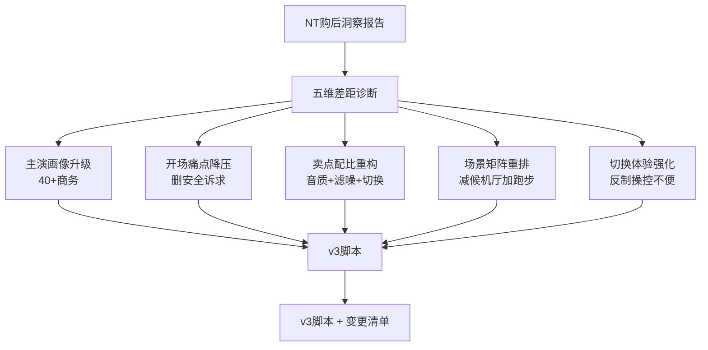

## 修改档位与总原则

**档位**：中改档（骨架保留、实景未开拍、北美优先）

**总原则**：

- 卖点从"滤噪唯一主角"改为"音质打底 + 滤噪惊喜 + 切换便捷"三足
- 叙事调性从"痛点压迫式"改为"专业需求被更好满足"——匹配滤噪作为**魅力属性**（50%+ 用户）的定位
- 主演画像匹配真实买家：40+岁、商务/专业人士、中高收入——北美科技爱好者身份可保留
- 场景矩阵向报告**高满意度场景**靠拢（工作学习、通话会议、室内健身、跑步骑行），弱化候机厅和"咖啡厅闲聊"

## 五个修改层面（具体到 cut）

### 1. 主演画像升级（无需改镜头数，只是选角调整）

- **白男**：从视觉感"年轻精干"改为 **40-55 岁、商务/专业人士感**（熨帖衬衫、简约外套、眼神沉稳）
- **棕男（Slide 4-5 棕男咖啡厅技术演示）**：同样偏成熟商务
- 健身房场景：不必选"肌肉强运动者"——40+ 商务人群健身动机是健康/减压（报告明示）；教练可以专业但主演体态是"坚持健身的商务人"
- 影响的 cut：全片所有实景（Cut 2-5、18-22、26-40）

### 2. 开场痛点降压（Slide 2，Cut 1-6）

| Cut   | 现状                                | 建议改动                                       | 依据                                 |
| ----- | --------------------------------- | ------------------------------------------ | ---------------------------------- |
| Cut 1 | 咖啡机+街道组镜头                         | **保留**，但速度感可更克制（商务用户的开场）                   | —                                  |
| Cut 2 | 办公室摘入耳揉耳                          | **保留**场景，把情绪从"不适"改为"专注被打断"（揉耳→摘下放在桌上、看向同事） | 40+ 商务人群核心痛点是复杂环境下听清关键             |
| Cut 3 | 全降噪女生没听见单车铃（安全痛点）                 | **替换**：办公室里戴全降噪没听到同事叫唤/电话响；或地铁通勤戴全降噪错过报站   | 报告无"安全"诉求支撑；而"错过关键信息"与 40+ 商务人群强相关 |
| Cut 4 | 候机厅通话捂耳听不清                        | **保留但降权**（1s），不作为主要痛点                      | 飞机火车是替代率最低的场景（11%-58%）             |
| Cut 5 | 咖啡厅与朋友聊天被咖啡机打断                    | **改为**：咖啡厅/联合办公空间做远程视频会议被咖啡机打断             | 通话会议是滤噪高满意度场景 TOP3                 |
| Cut 6 | 快切各国城市                            | **保留**（科技品牌的全球感）                           | —                                  |
| VO    | "你为了摆脱闷胀、封闭的安全隐患…"                | 改为："你选择了开耳，是因为不想被封闭——但复杂环境里，专注还是会被打乱"      | 降痛点压迫，升"专业需求"定位                    |
| Super | "传统入耳式耳机闷耳"→"全降噪式不安全"→"开放式环境噪音过多" | 第二条删"不安全"改为"听不见关键信息"；其余保留                  | 同上                                 |

### 3. 卖点配比重构（这是最核心的一处大动作）

现在脚本 90% 篇幅在论证滤噪。重新分配为：

**3.1 SuperBoost 段（Slide 3，Cut 13-18）—— 重新定位为"音质段"**

- 现在 VO："要过滤噪音，首先发声单元要足够强" → **先服务于滤噪**
- 改为："开耳听音乐，第一件事是发声单元要足够强。SuperBoost 的 50-40kHz 宽频，让音乐的细节不妥协" → **先服务于音质**
- Cut 15 双振膜鼓动 + 音波粒子扩散：视觉可保留，但添加 super **"音质：NT 用户推荐第一卖点（70.3%）"**（也可不加字，留给落版呼应）
- Cut 17 后面再承接一句过渡到滤噪："有了好音质打底，下一步让它理解环境"

**3.2 滤噪技术段（Slide 4-5，Cut 19-24）—— 保留骨架，调性降温**

- 现有 VO "在复杂的环境中实时判断"—— **保留**
- 现有 "扫描了 1000 多只真实的耳朵"—— **保留**（北美科技爱好者受众吃这一套）
- 但在段落结尾加一句承上启下：**"滤噪不是剥夺，是让开耳多一种选择"**—— 强调魅力属性

**3.3 切换体验段（Slide 6-8，Cut 29-36）—— 切换镜头升级**

- 现在 Cut 32 / Cut 34 的"开耳↔滤噪切换"镜头偏被动展示
- 改为 **"一键、不看耳机、动作自然"** 的切换呈现——用户轻点耳机边缘 + 画面 UI 轻提示 + 背景瞬间拉丝/去丝
- 对应不推荐 TOP3/4 的"操控不便"做反向防守

### 4. 场景矩阵重排（第二大动作）

现有矩阵 → 建议矩阵：

| 现有                   | 替代率/满意度            | 建议处理                                                    |
| -------------------- | ------------------ | ------------------------------------------------------- |
| 候机厅（Cut 29-31, 37）   | 飞机火车替代率最低（11%-58%） | **缩减至 1 个 cut**，放在开场痛点或落版混剪（Cut 4 或 Cut 37 保留其一）        |
| 办公室（Cut 32-33, 38）   | 工作学习是滤噪拉动最强场景      | **加强**：扩展到 2-3 cut，展示"戴着耳机听音乐 → 同事走近切换开耳 → 聊完切回滤噪"的完整流程 |
| 白男咖啡厅（Cut 34-35, 39） | 咖啡厅闲聊不在高满意场景       | **改造**为"咖啡厅独自办公/远程会议"（工作学习 + 通话会议合并）                    |
| 健身房（Cut 36, 40）      | 室内健身是北美高满意度场景      | **保留**（北美市场契合）                                          |
| —                    | 跑步/骑行通勤（滤噪高满意度）    | **新增 1 个 cut** 作为落版混剪或替换候机厅                             |
| —                    | 通话会议专项             | 通过"咖啡厅远程会议"或"办公室视频会议"cut 承担                             |

目标矩阵：**办公室 + 咖啡厅办公/会议 + 健身房 + 跑步骑行**（四场景），候机厅从主角降为过场

### 5. 结尾 VO + 落版 + 双锚点 super

- 结尾 VO 主调保留，但在落版前加一条双锚点 super：**"音质打底，滤噪加持 —— 这是 Shokz 对开耳的再定义"**
- 落版"Shokz-Open Ear NR"不变

### 6. Social Video 调整（轻改）

- **SV1**：对应主片场景调整，跟着主片换（减候机厅、加跑步/骑行）
- **SV2 (1000耳3D扫描)**：保留，北美科技爱好者受众吃这一套
- **SV3 (三麦克实验)**：保留，是滤噪魅力属性的技术论据
- 不新增 SV4（受"不大变动"约束）

## 不做的事

- 不推翻 TVC 四幕骨架
- 不删除 300 种噪音采集 / SuperBoost / 1000耳 3D 扫描三大技术卖点
- 不重拍未拍摄的场景之外的骨架镜头（实际上全未开拍，此条主要是对"科技段镜头"不做结构性删减）
- 不加竞品对比（脚本定位是 AO 品牌素材，非比较广告）

## 交付物

- **v3 脚本**：在 [用研与PMKT流程/【分镜脚本】韶音耳机0420v2.md](用研与PMKT流程/【分镜脚本】韶音耳机0420v2.md) 基础上另存为 `【分镜脚本】韶音耳机0421v3.md`，逐 cut 改动
- **变更清单**：v3 末尾或单独 md，列出每处改动 + 洞察依据（哪个数据/结论支持），便于与导演/剪辑团队对齐
- **不改动的保留项清单**：明确列出"哪些不动以及为什么不动"，避免协作方误拆

## 决策流程图

