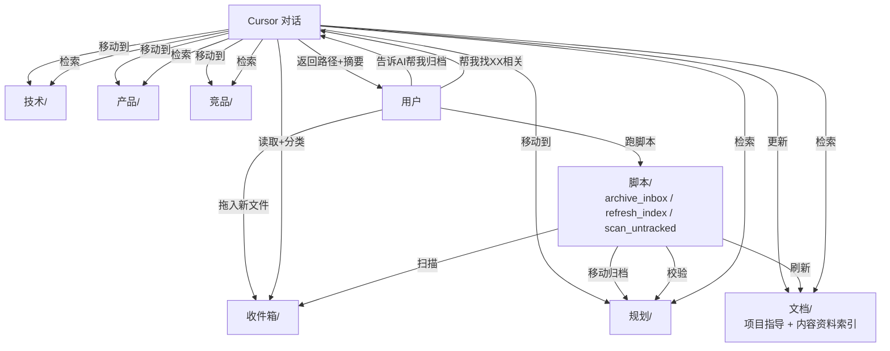

## 最终目录形态

```
科技树/
├── README.md                        ← 知识库入口（更新）
├── 目录索引.md                      ← 历史全局索引（保留/更新）
├── 科技树项目用户画像初步判断（非定稿）.md  ← 更新内部引用
│
├── 文档/                            ← 维护规则与全量索引
│   ├── 项目指导文档.md              ← 维护者手册（更新）
│   └── 内容资料索引.md              ← 全量文件索引（人读+AI读的主索引，更新+扩展）
│
├── 规划/                            ← 由 01-项目规划/ 重命名（新增 README.md）
├── 技术/                            ← 由 02-技术知识库/ 重命名（README 已有，更新）
├── 产品/                            ← 由 03-产品内容/ 重命名（README 已有，更新）
├── 竞品/                            ← 由 05-竞品与行业研究/ 重命名（README 已有，更新）
│
├── 04-营销传播/                     ← 保持不动（持续更新）
├── _系统工具/                       ← 保持不动
│
├── 收件箱/                          ← 【新建】新文件暂存
│   └── README.md                    ← 使用说明（如何存入、如何告诉 AI 处理）
│
└── 脚本/                            ← 【新建】Python 工具
    ├── README.md                    ← 脚本说明与调用方式
    ├── archive_inbox.py             ← 交互式归档：扫描收件箱→AI/人工分类→移动到对应分库→更新索引
    ├── refresh_index.py             ← 刷新 文档/内容资料索引.md（扫描实际目录树重建表格）
    └── scan_untracked.py            ← 校验：列出"实际存在但索引未登记"和"索引登记但实际不存在"的文件
```

**注**：暂不建 `数据/knowledge_base.json`、`历史版本/`、`唯一输出物.xlsx`——在你明确需要 Excel 产物之前不做。结构为将来升级预留（`脚本/generate_excel.py` 可随时加）。

---

## 核心工作流设计

### 存入流程（两条路径并存）

**日常路径（Cursor 对话）**：

```
1. 新文件拖到 收件箱/
2. 在 Cursor 里说："收件箱有新文件了，帮我归档"
3. AI 读取文件 → 判断分类 → 给出建议 → 你确认后 AI 执行移动 + 更新 文档/内容资料索引.md
```

**批量路径（脚本）**：

```
1. 多个新文件拖到 收件箱/
2. 跑 python 脚本/archive_inbox.py
3. 脚本对每个文件给出分类建议 → 终端交互式 y/n/改分类
4. 确认后自动移动 + 刷新索引
```

### 提取流程（Cursor 对话为主）

```
粗粒度：打开 文档/内容资料索引.md 扫清单
细粒度：告诉 Cursor "帮我找关于 XX 的内容" → AI 直接定位文件 + 给摘要
```

不做 Excel 总表，避免与 MD 索引双份维护导致漂移。

### 维护流程

```
定期（建议每月）：
  python 脚本/scan_untracked.py   ← 发现未登记/失效的文件
  python 脚本/refresh_index.py    ← 根据实际目录重建索引
```

---

## 执行步骤

### 步骤 1：物理重命名 4 个一级目录

- `01-项目规划/` → `规划/`
- `02-技术知识库/` → `技术/`
- `03-产品内容/` → `产品/`
- `05-竞品与行业研究/` → `竞品/`

### 步骤 2：新建骨架目录

- `收件箱/`（带一份 README.md 说明用法）
- `脚本/`（带一份 README.md 说明脚本用法）

### 步骤 3：更新所有包含老路径引用的文件

已扫出 8 处需要修改（路径字符串替换）：

- [科技树/README.md](科技树/README.md)
- [科技树/目录索引.md](科技树/目录索引.md)
- [科技树/科技树项目用户画像初步判断（非定稿）.md](科技树/科技树项目用户画像初步判断（非定稿）.md)
- [科技树/文档/项目指导文档.md](科技树/文档/项目指导文档.md)
- [科技树/文档/内容资料索引.md](科技树/文档/内容资料索引.md)
- `科技树/技术/README.md`（原 02-技术知识库/README.md）
- `科技树/产品/README.md`（原 03-产品内容/README.md）
- `科技树/竞品/README.md`（原 05-竞品与行业研究/README.md）
- `科技树/04-营销传播/202604 NT-AO/文案安排-领英/LinkedIn适合作为技术叙事承接阵地的洞察（附参考文献）.md`（仅修内部链接）

### 步骤 4：新建 `规划/README.md`

参考已有分库 README 版式，覆盖顶层战略/立项/方法论内容说明。

### 步骤 5：更新文档内容

- `README.md`：新增"收件箱/""脚本/"章节，新增"规划/"章节，去掉编号，更新"日常工作流"为"新文件→收件箱→告诉AI"
- `文档/项目指导文档.md`：边界定义改用新命名；新增"存入/提取工作流"章节；新增"AI 协作约定"（告诉 AI 怎么归档）
- `文档/内容资料索引.md`：新增"规划/"章节；所有路径更新
- `文档/内容资料索引.md` 增加一段 AI 使用说明，让 Cursor 读到这份索引时能正确理解分类规则

### 步骤 6：开发 3 个 Python 脚本

**[脚本/archive_inbox.py](科技树/脚本/archive_inbox.py)**（约 120 行）：

- 扫描 `收件箱/` 下所有文件
- 读取 `文档/项目指导文档.md` 里的分类规则 + `文档/内容资料索引.md` 的现有结构
- 对每个文件：根据文件名关键词匹配建议分类（例：含"FABE"→产品/；含"研究报告"→竞品/；含"原理/振膜/频率"→技术/）
- 终端交互：`[文件名] 建议归类 → [路径] (y=接受/n=跳过/e=手动输入)`
- 接受后：移动文件 + 在 `文档/内容资料索引.md` 对应表格追加一行

**[脚本/refresh_index.py](科技树/脚本/refresh_index.py)**（约 80 行）：

- 扫描 `规划/ 技术/ 产品/ 竞品/` 下所有文件
- 按现有 `文档/内容资料索引.md` 的格式（子目录 → 表格）重新生成内容
- 保留"全局观察""内容缺口"等手工维护段落（通过段落标记分隔）

**[脚本/scan_untracked.py](科技树/脚本/scan_untracked.py)**（约 50 行）：

- 读取 `文档/内容资料索引.md` 中所有文件路径
- 与实际目录树对比
- 输出：未登记清单 + 登记但不存在清单

依赖：纯标准库（`pathlib`、`re`、`argparse`），无需安装任何第三方包。

### 步骤 7：处理 3 组疑似重复文件（需你在 confirm 时指定策略）

MD5 比对已确认 3 组都**内容不同**：

**组 A：`NCE FABE.xlsx`**

- `产品/NCE/NCE FABE.xlsx`（MD5: AD0F6A7C）
- `产品/2026下半年舒适/NCE FABE.xlsx`（MD5: 19A7976B）
- 建议：两份都保留，我在 `产品/2026下半年舒适/README.md` 加一行说明"本目录 NCE FABE 是 2026 下半年舒适版本，与 产品/NCE/ 下 FABE 为不同版本"

**组 B：`OpenSound 技术平台内容介绍.md`**

- `技术/NT-开放式技术学习/OpenSound技术平台内容介绍(内部学习用）.md`（19565 字节，更全）
- `产品/OpenSound-Pro/OpenSound Pro技术平台内容介绍(内部学习用）.md`（16995 字节）
- 建议：保留技术侧全版，产品侧改为一个引用说明文件（README 注明"技术原理见 技术/...，本目录聚焦产品级物料"）

**组 C：`为什么开放式耳机更需要一颗好喇叭.md` vs `- 留一份.md`**

- 只差 117 字节，大概率是小幅修订
- 建议：由我生成 diff 报告给你，你看完再决定删哪版（Plan 阶段不执行删除）

请在确认 Plan 时回复这三组的处置选择（可以说"按建议"或具体指定）。

### 步骤 8：清理文件名 OS 自动后缀（建议项，可跳过）

- `产品/BOS/BOS  月银白 新色上市计划书 (1).md` → 去掉 `(1)` 和多余空格
- 全量扫描类似情况

---

## 整体架构




---

## 风险与保底

- **脚本安全**：所有涉及"移动/删除"的操作都走交互式确认，不会静默删文件
- **索引漂移**：提供 `scan_untracked.py` 主动发现漂移
- **回滚**：目录重命名可用同样命令反向；脚本不涉及 git
- **中文路径**：PowerShell + Python + Cursor 工具都能处理

---

## 不在本次范围（明确标记）

- ❌ `数据/knowledge_base.json`（不做结构化权威数据源，后续需要 Excel 再追加）
- ❌ `科技树知识库.xlsx` 产物（暂时靠 Cursor 对话和 MD 索引）
- ❌ `历史版本/`（没有 xlsx 产物就不需要自动备份）
- ❌ 知识点颗粒度抽取（方案 B，工作量太大）
- ❌ `04-营销传播/`（持续更新，不纳入骨架）
- ❌ NT 系列编号错乱修复（留待下次专项）

