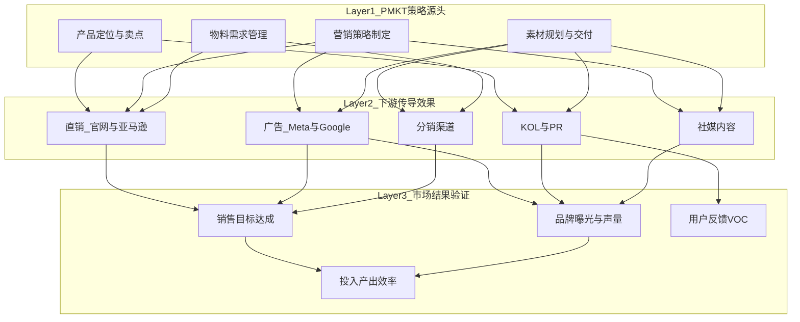

# PMKT 上市复盘评估框架设计

## 核心思路

从10份复盘文档中提炼出的规律：PMKT 的工作本质上是 **"策略制定 + 素材供给"**，其效果并非直接体现为销量数字，而是通过下游各板块的执行质量间接传导到市场结果。因此评估框架应采用 **三层传导模型**：

## 框架结构：三层六维评估体系

### Layer 1 — PMKT 策略源头评估（4个维度）

**维度1: 产品定位与卖点策略**

- 定位是否清晰且差异化（对标竞品）
- 卖点提炼是否准确传递到各板块（如 UCS 复盘中"理性科技 vs 感性场景"的差异发现）
- 产品矩阵策略是否合理（如气导线"1+1=?"的组合逻辑）

**维度2: 营销策略制定**

- 节奏规划（预热期/上市期/延续期）是否合理
- 节点借势（CES/RunDisney/纽马等）是否有效
- 策略与产品定位的一致性

**维度3: 素材规划与交付**

- 数量完整性：物料 checklist 完成率
- 质量达标性：调性一致、平台适配、创意水平
- 时效性：是否按节点交付、是否影响下游排期
- 关键发现来源：[UCS上市复盘](复盘文件/整理好的格式/UCS上市复盘（pmkt素材及营销策略分析）.md) 中的"素材交付质量"分析模式

**维度4: 物料需求管理**

- 需求收集是否覆盖各板块（DM、官网、社媒、分销）
- 规格/数量是否满足硬性要求
- 关键教训来源：银色款复盘中"详情页无银色款图片"的协作问题

### Layer 2 — 下游传导效果评估（5个板块）

每个板块评估两个核心问题：

1. **策略承接度** — PMKT 的策略是否被准确理解和执行？
2. **素材转化效果** — PMKT 提供的素材在该渠道的实际表现如何？

具体板块：

- **直销（官网+亚马逊）**：Listing/详情页物料质量、预热页承接机制、转化率
- **广告（Meta+Google）**：不同调性素材的 ROAS/CPC 差异、素材迭代效率
- **KOL/PR**：Briefing 质量、测评内容与卖点一致性、CPM、发稿量/质量
- **社媒**：内容调性一致性、互动率、平台适配
- **分销**：POP/零售物料到位率、陈列执行

### Layer 3 — 市场结果验证（闭环指标）

- **销售目标达成率**：首周/首月 vs 目标，分渠道
- **品牌曝光与声量**：Campaign 总曝光、媒体发稿量、奖项
- **用户反馈**：Amazon 评分、VOC 亮暗点分布
- **投入产出效率**：MKT 费用占预算比、整体 ROAS

## 评估方法论（4种分析方法组合使用）

**方法A: 目标对标法** — 实际 vs 计划目标的达成率，适用于 Layer 3 的量化指标

**方法B: 历史横比法** — 跨产品上市对比（如 BOS vs CCT vs OpenFit 2），发现 PMKT 策略迭代的进步/退步，文档中已有"1+1=?"口径可复用

**方法C: 传导归因法** — 从市场结果（Layer 3）向上追溯到 PMKT 决策（Layer 1），回答"这个结果好/坏，是因为 PMKT 的哪个决策？"，如 UCS 复盘中"理性科技素材社媒效果优于感性场景"可归因到素材规划决策

**方法D: 亮暗点结构化萃取** — 现有文档已普遍采用亮点/暗点对照，将其结构化为"现象 → 原因 → PMKT 可控/不可控 → 改进方向"四列格式

## 交付物

在 `复盘文件/` 目录下创建一份 Markdown 文件 `PMKT复盘评估框架.md`，包含：

- 框架全景图（Mermaid 图）
- 三层评估维度的详细说明与评估问题清单
- 四种分析方法的操作指南
- 一份基于现有10份文档的 **评估维度覆盖度对照表**（哪些文档覆盖了哪些维度，哪些维度普遍缺失需要补充）

