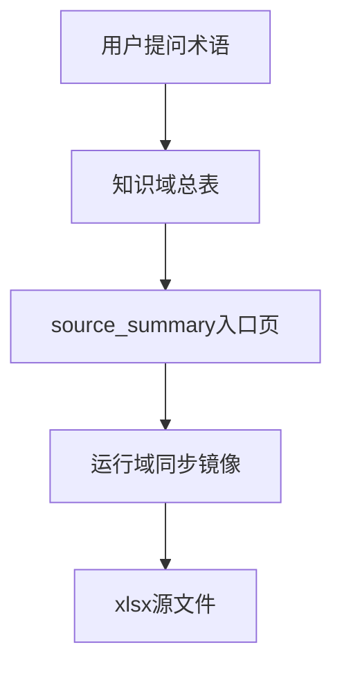

# PMKT术语总表落位方案

## 核心决策

- 保留 [知识域/概念原理/术语卡/PMKT产品营销专业术语库_同步版.md](C:/Users/016551/OneDrive/Desktop/科技树/知识库/知识域/概念原理/术语卡/PMKT产品营销专业术语库_同步版.md) 作为 `source_summary` 入口页。
- 新增 [知识域/概念原理/术语卡/PMKT产品营销专业术语库.md](C:/Users/016551/OneDrive/Desktop/科技树/知识库/知识域/概念原理/术语卡/PMKT产品营销专业术语库.md) 作为知识域内的可读总表，默认按 `concept` 管理。
- 保留 [运行域/同步文档/PMKT产品营销专业术语库_fde4cdb6/PMKT专业术语库.md](C:/Users/016551/OneDrive/Desktop/科技树/知识库/运行域/同步文档/PMKT产品营销专业术语库_fde4cdb6/PMKT专业术语库.md) 作为抽取镜像与追溯层，不把它当最终知识正文。
- 不改同步脚本或配置，直接复用现有索引规则：`*_同步版.md` 继续走 `source_summary`，`术语卡/` 下的新正文页走 `concept`。

## 现有规则依据

- [运行域/脚本/refresh_index.py](C:/Users/016551/OneDrive/Desktop/科技树/知识库/运行域/脚本/refresh_index.py) 已经有现成的类型推断顺序：显式 `kb_type` 优先，其次是文件名 `_同步版.md`，再其次是父目录 `术语卡/`。这意味着不改代码也能把两类文件在索引里分开显示。
- [运行域/治理文档/元数据规范.md](C:/Users/016551/OneDrive/Desktop/科技树/知识库/运行域/治理文档/元数据规范.md) 已明确：`source_summary` 用于导航和追溯，`concept` 用于稳定术语和机制知识。
- [知识域/概念原理/README.md](C:/Users/016551/OneDrive/Desktop/科技树/知识库/知识域/概念原理/README.md) 已明确 `术语卡/` 的职责是“高频复用概念锚点”。

## 实施内容

### 1. 新增知识域可读总表

创建 [知识域/概念原理/术语卡/PMKT产品营销专业术语库.md](C:/Users/016551/OneDrive/Desktop/科技树/知识库/知识域/概念原理/术语卡/PMKT产品营销专业术语库.md)：

- 从 [运行域/同步文档/PMKT产品营销专业术语库_fde4cdb6/PMKT专业术语库.md](C:/Users/016551/OneDrive/Desktop/科技树/知识库/运行域/同步文档/PMKT产品营销专业术语库_fde4cdb6/PMKT专业术语库.md) 提升内容进入知识域。
- 保留当前表格主体，不重写术语解释本身，只做最小知识化包装：frontmatter、用途说明、分类标题、回链入口。
- 默认使用 `kb_type: concept`；`status` 先用 `draft` 或 `review` 的保守值，避免把“从表抽来的第一版总表”直接装成完全定稿。
- `source_docs` 指向 `_同步版` 入口页，必要时再补到运行域同步镜像。

### 2. 把现有 _同步版 入口页补成标准 source_summary

更新 [知识域/概念原理/术语卡/PMKT产品营销专业术语库_同步版.md](C:/Users/016551/OneDrive/Desktop/科技树/知识库/知识域/概念原理/术语卡/PMKT产品营销专业术语库_同步版.md)：

- 补 frontmatter，显式标成 `kb_type: source_summary`。
- 页面正文从“只有一个运行域链接”的跳板，升级成三层导航：
  - 源文件：`PMKT产品营销专业术语库.xlsx`
  - 知识域标准正文：`PMKT产品营销专业术语库.md`
  - 运行域同步镜像：`运行域/同步文档/.../PMKT专业术语库.md`
- 明确写清三者分工：知识域正文用于提问与引用，运行域镜像用于追溯，xlsx 用于备查。

### 3. 刷新索引与记录

- 运行 [运行域/脚本/refresh_index.py](C:/Users/016551/OneDrive/Desktop/科技树/知识库/运行域/脚本/refresh_index.py)，让 [运行域/治理文档/内容资料索引.md](C:/Users/016551/OneDrive/Desktop/科技树/知识库/运行域/治理文档/内容资料索引.md) 同时出现：
  - 一条 `source_summary`：`PMKT产品营销专业术语库_同步版.md`
  - 一条 `concept`：`PMKT产品营销专业术语库.md`
- 在 [运行域/治理文档/log.md](C:/Users/016551/OneDrive/Desktop/科技树/知识库/运行域/治理文档/log.md) 追加一条记录，说明这次是把术语库从“入口 + 镜像”提升为“入口 + 知识域正文 + 镜像”。

### 4. 验证问答路径是否被扳正

完成后按下面的目标路径检查：

预期变化：

- 改造前：更容易走 `source_summary -> 运行域同步镜像 -> 回答`
- 改造后：优先走 `知识域总表 -> 必要时 source_summary -> 运行域同步镜像`

## 参考样式

可参考库里已经更接近“三层分工”的组织方式：

- [知识域/产品主张/OpenSound-Pro/OpenSound Pro 技术平台手册_同步版.md](C:/Users/016551/OneDrive/Desktop/科技树/知识库/知识域/产品主张/OpenSound-Pro/OpenSound Pro 技术平台手册_同步版.md)
- [知识域/产品主张/NCE/nce_fabe_output.md](C:/Users/016551/OneDrive/Desktop/科技树/知识库/知识域/产品主张/NCE/nce_fabe_output.md)

## 结果预期

落地后，这份 PMKT 术语库会形成稳定的三层分工：

- `xlsx`：原始证据
- `运行域同步 md`：抽取镜像
- `知识域总表 md`：真正参与问答、阅读和引用的正文

这样既不丢追溯链，也能把 AI 的默认回答路径从“先钻运行域”扳回“先命中知识域”。