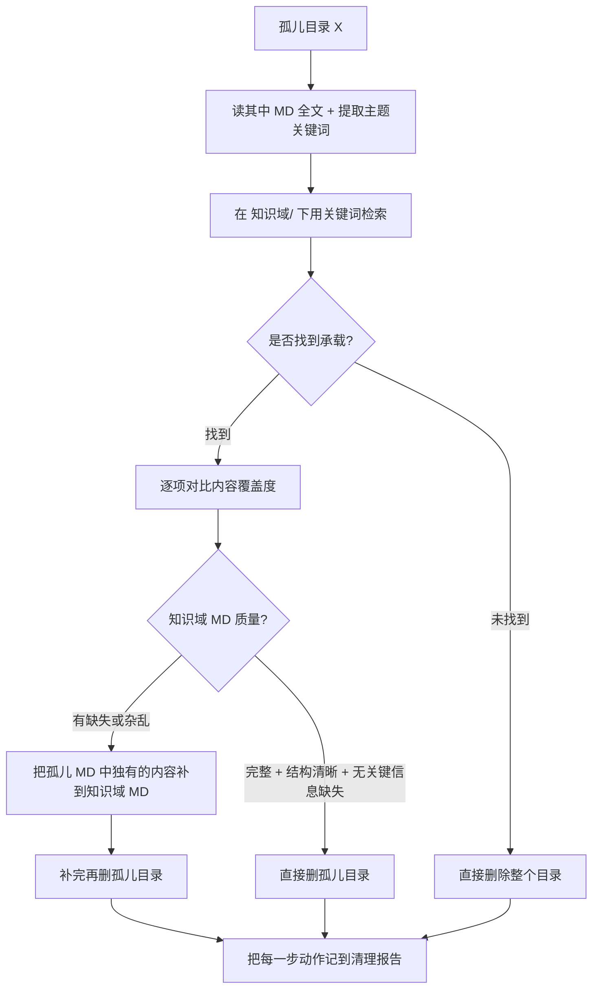

## 执行总则

- **筛选范围**：仅处理 [运行域/同步文档/index.md](知识库及前端开发/知识库/运行域/同步文档/index.md) 中标注 `Source exists: no` 的 11 个子目录
- **跳过项**：`Source exists: yes` 的活跃同步目录、`index.md`、`README.md`、`_tmp_sync_`* 临时目录
- **辅助条件**：默认这 11 个孤儿目录都已超 15 天未修改（最早同步时间在 `2026-04-22`），逐个核验文件 mtime 即可
- **承载检查域**：仅在 [知识库/知识域/](知识库及前端开发/知识库/知识域/) 下查找

## 待处理的 11 个孤儿目录

来源全部从 [index.md](知识库及前端开发/知识库/运行域/同步文档/index.md) 中提取，按原 Source 路径分组：

- 技术/NT-开放式技术学习/ → `【NT技术卖点培训】-OpenFit Pro-0211_4170fbc6/`、`【NT技术卖点培训】-OpenFit_Pro-0211_4170fbc6/`（注意有两个，目录名差一个下划线）
- 规划/ → `北美2025年战略启动会250513_2cddfe77/`
- 竞品/华为/ → `华为折叠屏技术营销五步法模型_106c172d/`
- 技术/科技树总览/ → `科技树思路梳理——加工中_c6aca119/`、`韶音科技树总览（可传播，持续更新）(2)_82cf51f8/`
- 技术/骨传导声学/ → `骨传导耳机的先天弊端与对应解决方案_3467f50c/`、`骨导耳机发展_aded93b8/`
- 产品/2026下半年舒适/ → `NCE_FABE_fdc43a8f/`、`LOK_FABE_3dfc9264`（OpenDots ONE FABE）、`OpenDots ONE_FABE_3dfc9264/`、`XS_FABE_6488fd64/`

## 单个目录的处理流程

## 质量判断的具体标准

知识域 MD 视为"良好"需同时满足：

1. 有可识别的标题层级（至少有 H1 + H2）
2. 无成片乱码、无 `$\color{}` 之类钉钉/飞书残留
3. 孤儿 MD 中的关键事实/数据/结论在知识域 MD 中能找到对应承载（不要求逐字一致，但不能丢核心信息点）
4. 表格、列表结构完整，没有截断

任一条不满足即判"不良好"，触发补全。

## 交付物

1. 一份清理报告（Markdown），列出每个目录的：判定（直接删/补全后删）、承载位置、改动摘要
2. 直接执行删除（按你之前认的"直接动手修"基调），但报告里逐项交代清楚
3. 如果在执行过程中遇到无法判断承载关系的边缘案例，停下来问你

## 不做的事

- 不动 `Source exists: yes` 的 6 个活跃同步目录
- 不改 `index.md`（它由 file-sync 流程维护，删完目录后下一次同步会自动更新；如果你需要我手动同步更新它，这条单独说）
- 不动 `知识域/` 之外的目录（即使知识域里没找到，也不去 `策略判断/`、`概念原理/` 等其他位置外的地方搜——不过 `知识域/` 本身就涵盖这几个子域）
- 不删 `_tmp_sync_*` 临时目录（那是 file-sync 工具的工作区，由它自己管理）

