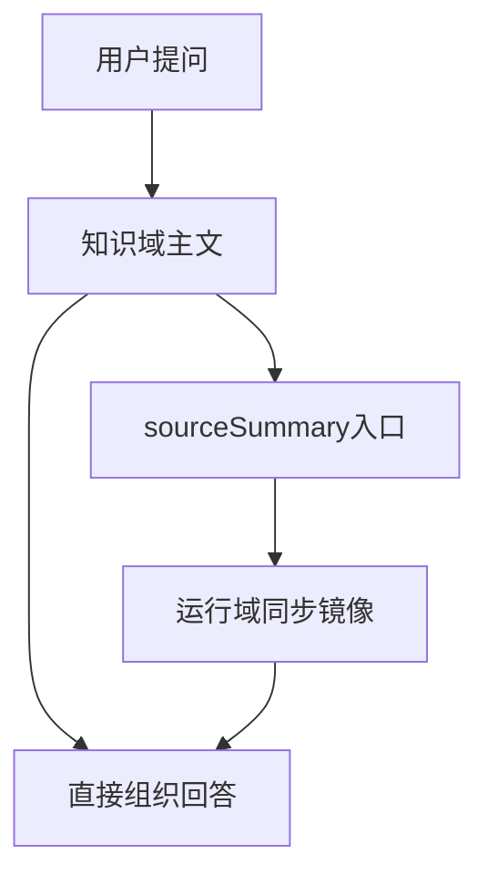

# 提升术语库为知识主文

## 目标

把当前这条链路：

`提问 -> [知识域/概念原理/术语卡/PMKT产品营销专业术语库_同步版.md](知识域/概念原理/术语卡/PMKT产品营销专业术语库_同步版.md) -> [运行域/同步文档/PMKT产品营销专业术语库_fde4cdb6/PMKT专业术语库.md](运行域/同步文档/PMKT产品营销专业术语库_fde4cdb6/PMKT专业术语库.md) -> 回答`

改成：

`提问 -> 知识域里的可读主文 -> 必要时再回看 source_summary / 同步镜像`

## 打算怎么做

### 1. 在知识域补一份真正的主文

基于当前的同步表格，在 [知识域/概念原理/术语卡/](知识域/概念原理/术语卡/) 新建一份可读主文，例如 `PMKT产品营销专业术语库.md`。

这份主文不再只是跳转页，而是知识层正文：

- 使用 [运行域/治理文档/模板/concept_template.md](运行域/治理文档/模板/concept_template.md) 的骨架做 frontmatter 和正文组织
- `source_docs` 指回当前来源入口和必要的同步镜像
- 正文直接承载术语总表，保证 AI 首先命中这份知识层 Markdown

### 2. 把 `_同步版.md` 收缩回“来源入口页”

保留 [知识域/概念原理/术语卡/PMKT产品营销专业术语库_同步版.md](知识域/概念原理/术语卡/PMKT产品营销专业术语库_同步版.md)，但它只承担追溯职责：

- 指向知识域主文
- 指向运行域同步镜像
- 指向原始 `xlsx`

这样入口页和知识正文的角色分开，不再让 `_同步版.md` 同时扮演“知识主文”和“追溯跳板”。

### 3. 明确 AI 的默认回答路径

围绕这份术语库，把默认问答路径收敛为：

- 先看知识域主文
- 主文里找不到，再回看 `_同步版.md`
- 需要逐行追溯时，再去 [运行域/同步文档/PMKT产品营销专业术语库_fde4cdb6/PMKT专业术语库.md](运行域/同步文档/PMKT产品营销专业术语库_fde4cdb6/PMKT专业术语库.md)

这会让这份知识在体验上从“后台可读”变成“前台可答”。

### 4. 补一条小规则，避免以后继续倒置

针对这类“单表、稳定、可直接问答”的术语库/词典类 Excel，补最小约定到文档层：

- [知识域/概念原理/README.md](知识域/概念原理/README.md)
- [运行域/治理文档/元数据规范.md](运行域/治理文档/元数据规范.md)

规则会写清：

- 运行域同步文档仍然是镜像，不是知识主文
- 但术语总表这类稳定知识，应该在知识域有一份可直接引用的 Markdown 主文

### 5. 只做轻量机制修正，不大改同步引擎

我默认先不去大改 [运行域/脚本/sync_binary_docs.py](运行域/脚本/sync_binary_docs.py) 的通用行为。

原因是这次你的核心问题不是“抽取失败”，而是“知识层没有承接好”。更稳的做法是先把知识层主文补起来，再视是否频繁出现同类文件，决定要不要把“术语库自动提升为知识主文”做成脚本规则。