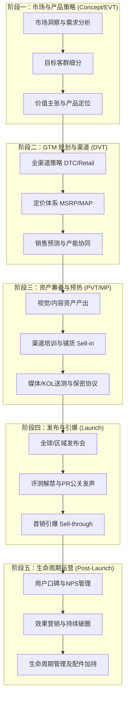

# 消费电子产品行业标准 GTM (上市策略) 工作流程

跳出内部特定的文档，以下是基于全球消费电子行业（如苹果、索尼、大疆等主流硬件厂商）通用的硬件产品 Go-to-Market 标准生命周期。它将硬件研发的工程里程碑（EVT/DVT/PVT/MP）与商业、市场营销动作深度结合。

## 核心工作流图解

## 详细阶段任务 (SOP)

### 阶段一：市场与产品策略期 (Market & Product Strategy)
*与产品定义及 EVT (工程验证) 阶段同步进行*
- **市场规模与竞争分析**：进行 TAM/SAM/SOM 分析，扫描全球/区域竞争对手动态，寻找市场空白与差异化机会。
- **目标受众细分 (Segmentation)**：清晰描绘核心目标受众（Primary Target）与次级受众（Secondary Target）的人口学与心理学特征。
- **产品定位与价值主张 (Value Proposition)**：提炼产品的核心卖点（USP - Unique Selling Proposition），形成一句话的电梯游说（Elevator Pitch）和完整的 Messaging Framework（沟通信息矩阵）。

### 阶段二：GTM 规划与渠道策略 (Go-to-Market Planning)
*与 DVT (设计验证) 阶段同步进行*
- **渠道策略 (Channel Strategy)**：确定线上 DTC（官网/独立站）、电商平台（京东/天猫/Amazon）与线下实体零售（Apple Store/BestBuy/代理商）的销售比重与合作模式。
- **价格体系 (Pricing Strategy)**：基于成本、竞品及品牌定位，制定全球及各区域的价格阶梯，包括建议零售价（MSRP）和最低广告标价（MAP）政策。
- **销售预测与备货协同**：销售端输出首发及生命周期销售预测（Forecast），与供应链协同，保障首发日（T-Day）的全球库存分仓到位（Sell-in）。

### 阶段三：资产筹备与预热期 (Asset Creation & Readiness)
*与 PVT (生产验证) 至 MP (量产) 阶段同步进行*
- **整合营销企划 (IMC Plan)**：敲定线上线下联动营销的 Big Idea，制定媒介投放（Paid）、公关传播（Earned）、社媒运营（Shared）与自有阵地（Owned）的 PESO 模型策略。
- **营销资产制作**：完成产品包装设计（Packaging）、核心主视觉（KV）、宣传片（TVC）、电商 A+ 页面素材及线下门店陈列物料（POSM）。
- **销售赋能与培训 (Sales Enablement)**：向一线导购、客服、代理商输出销售指导手册（Sales Playbook）及话术培训。
- **媒体公关与早鸟评测**：向核心科技媒体、行业领袖及头部 KOL 发送评测样机，签署保密协议（NDA），进行深度产品 Briefing，确保评测方向准确。

### 阶段四：发布与引爆期 (Launch & Execution)
*围绕 T-Day (发售日) 展开的集中战役*
- **官宣与发布仪式 (Unveiling)**：举办产品发布会（线下/线上），或全网同步释放官宣视频/新闻稿，公布价格与开售时间。
- **评测解禁与声量爆发 (Embargo Lift)**：核心媒体与 KOL 评测内容在同一时间点全网统一解禁，瞬间抢占科技数码圈头条，引爆全网讨论。
- **转化与首销 (Sell-through)**：全渠道正式开售，启动强力效果广告（Performance Marketing），配合电商平台的首发 IP 或早鸟优惠（Early-bird Offers），最大化收割首发流量。

### 阶段五：生命周期与口碑运营 (Post-launch & Lifecycle)
*T+30 及以后的长线运营*
- **用户反馈与口碑管理 (Ratings & Reviews)**：监控首批用户的真实反馈，处理客诉与软件 Bug（OTA 修复）；在电商平台及论坛积累高质量用户评价，提升转化率。
- **持续破圈与效果优化**：通过 A/B 测试优化广告素材，从极客圈层（Early Adopters）向大众消费群体（Early Majority）渗透。
- **生命周期管理 (Lifecycle Management)**：适时推出新配色、联名款或核心配件（Accessories），在销售疲软期策划促销节点（双11/黑五），延长产品的市场生命周期。