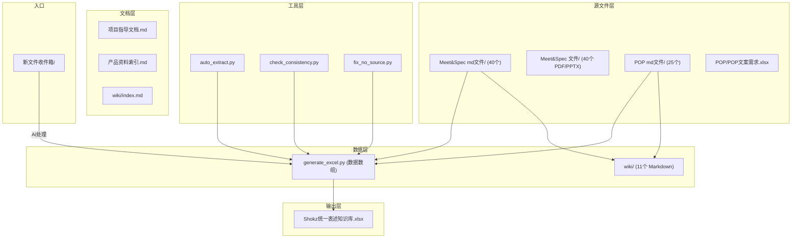

# 统一表述知识库 — 产品体验诊断与改进方案

## 一、现状总览

当前知识库包含 127+ 文件，涉及 26 个产品线，三语（EN/ZH/FR）术语管理。核心产出物是 `Shokz统一表述知识库.xlsx`。

## 二、从"使用者"视角发现的七个核心问题

### 问题 1：没有统一入口，新人不知道先看什么

当前有 **3 个并行入口**，各自讲的还不一样：

- [项目指导文档.md](统一表述知识库/项目指导文档.md) -- 说 Excel 有 3 个 Sheet
- [wiki/index.md](统一表述知识库/wiki/index.md) -- 说 Excel 有 6 个 Sheet
- [产品资料索引.md](统一表述知识库/产品资料索引.md) -- 只管文件覆盖情况

**建议**：创建一个简洁的 `README.md` 作为**唯一首页**，用一页纸讲清楚：这是什么、怎么用、文件在哪。将 `项目指导文档.md` 降级为"开发者/维护者手册"。

---

### 问题 2：wiki/ 与 generate_excel.py 双轨并行，权威不清

目前有两套数据存储在并行运转：

- **generate_excel.py 内的 Python 数组** -- Cursor 规则指定为第一优先
- **wiki/ 下 11 个 Markdown 文件** -- 按主题分类的浏览式知识库

两者**没有自动同步机制**，极易漂移。`项目指导文档.md` 把 wiki 标为"辅助参考"，但 wiki 自己的 `index.md` 看起来像是正式的主索引。

**建议**：明确二选一：

- **方案 A**：wiki 作为 generate_excel.py 的**只读展示层**，由脚本自动从 Python 数组生成，不允许手动编辑 wiki
- **方案 B**：废弃 wiki，用 `产品资料索引.md` + Excel 本身覆盖浏览需求
- 推荐方案 B（更简单，减少维护负担）

---

### 问题 3：产品资料索引与实际文件不一致

`产品资料索引.md` 第 66 行写：

> "原始文件几乎没有保留——只有 OpenSwim Pro 有 PDF 原始文件"

但实际 `Meet&Spec 文件/` 下**几乎每个产品都有 PDF/PPTX 原始文件**（总计约 1.2GB）。这会严重误导使用者和 AI。

此外，"原始文件"列全部标 ❌（除 OpenSwim Pro），与事实完全不符。

**建议**：重新扫描实际文件生成准确的产品资料索引，或写一个脚本自动生成。

---

### 问题 4：项目指导文档与 wiki 描述的 Excel 结构矛盾

- `项目指导文档.md` 第 31-37 行：Excel 有 **3 个 Sheet**（总查询表、产品名与标语、使用说明）-- **与代码一致**
- `wiki/index.md` 第 50-57 行：Excel 有 **6 个 Sheet**（术语总表、动作表达、营销表达、产品名写法、写作规则、使用说明）-- **已过时**

**建议**：删除或更新 wiki/index.md 中的过时描述，确保只有一个地方定义 Excel 结构。

---

### 问题 5：文件命名风格极度不统一

产品文件夹和文件名的命名存在多种风格混杂：

- 大小写：`Opencomm UC` vs `OpenComm` vs `OPENRUN PRO`
- 空格：`OpenDotsOne`（无空格） vs `OpenFit Pro`（有空格）
- 语言标记：`[English]` vs `(English)` vs `_US` vs `_FR` vs `法语版`
- Meet/Spec 标记：`meet` vs `MEET` vs `Meet`

这不仅影响人类阅读，也会导致脚本的正则匹配不稳定。

**建议**：建立一套命名规范，并逐步统一（至少新文件必须遵守）：

- 产品文件夹统一用标准产品名（如 `OpenComm 2 UC`）
- 文件名格式：`[产品名]_[文档类型]_[语言].md`
- 语言标记统一用 `_EN` `_FR` `_ZH`

---

### 问题 6：POP 目录结构混乱

当前有两个 POP 相关目录，关系不清：

- `POP/` -- 只有一个 10.9MB 的总表 Excel，与拆分后的 md 是什么关系？
- `POP md文件/` -- 25 个按产品拆分的 Markdown

而 Cursor 规则 `inbox-process.mdc` 第 57 行还提到一个**不存在的** `POP 文件/[产品名]/` 目录。

**建议**：

- 将 `POP/` 重命名为 `POP 原始文件/`，明确它是 md 的源文件
- 更新 inbox-process.mdc，修正 POP 归档路径
- 在 README 中说明 POP 总表 Excel 与 POP md 文件的关系（总表是源，md 是拆分）

---

### 问题 7：数据全部硬编码在 Python 代码里

`generate_excel.py` 的 523 行中，约 340 行是数据（Python tuple 数组），只有 180 行是逻辑代码。非编程背景的维护者无法直接阅读或审查数据内容。

这是之前讨论过但被搁置的"优先级 1"问题。虽然当前通过 AI 代为操作可以工作，但长期来看仍然是一个脆弱点。

**建议**（不急，后续可做）：将数据抽到 CSV 或 JSON 文件中，`generate_excel.py` 只负责读取和生成。

---

## 三、新增需求：Excel 版本历史管理

Excel 是知识库的**唯一正式输出物**，每次更新都应保留旧版本以便追溯和回退。

### 设计方案

**新建文件夹**：`统一表述知识库/历史版本/`

**命名格式**：`Shokz统一表述知识库_vX.X_YYYY-MM-DD.xlsx`

- 例如：`Shokz统一表述知识库_v1.0_2026-04-13.xlsx`

**自动化流程**：修改 `generate_excel.py`，在生成新 Excel 之前自动执行：

1. 检查当前是否存在 `Shokz统一表述知识库.xlsx`
2. 如果存在，将其复制到 `历史版本/` 并按格式重命名
3. 版本号从 `历史版本/` 文件夹中已有的最大版本号递增
4. 然后再生成新的 Excel 覆盖根目录的文件

**同步更新收件箱规则**：`inbox-process.mdc` 第四步补充"生成 Excel 前先备份旧版本"的提醒。

`**历史版本/` 文件夹内加一个 README**，说明：

- 这里存放每次更新前的旧版本
- 文件名中的版本号和日期对应更新时间
- 如需回退，直接用历史版本覆盖根目录的 xlsx 即可

---

## 四、其他观察

- `__pycache__/` 应该被忽略（添加 `.gitignore` 或手动删除）
- `fix_no_source.py` 直接改写 `generate_excel.py` 的源码，风险较高——如果正则匹配出错会破坏文件
- 整个项目没有版本控制（不是 git repo），历史版本文件夹可以部分弥补这个问题

---

## 五、推荐改进路线（按优先级）

### P0：修复事实错误 + Excel 版本管理（影响准确性和安全性）

- 重新生成准确的 `产品资料索引.md`，修正"原始文件"列
- 统一 `项目指导文档.md` 和 `wiki/index.md` 中对 Excel 结构的描述
- **新增**：创建 `历史版本/` 文件夹，修改 `generate_excel.py` 在生成前自动备份旧版，更新 `inbox-process.mdc` 流程

### P1：统一入口，降低认知负担

- 创建 `README.md` 作为唯一首页
- 明确 wiki/ 的定位（推荐降级或废弃）
- 整理目录说明，让文件夹结构一目了然

### P2：修复 Cursor 规则中的路径错误

- 修正 `inbox-process.mdc` 中不存在的 `POP 文件/[产品名]/` 路径
- POP 归档逻辑与实际目录对齐

### P3：命名规范化

- 制定文件命名规范并写入 README
- 新文件严格遵守，历史文件逐步迁移

### P4（可选）：数据与代码分离

- 将 generate_excel.py 中的数据数组抽到 CSV/JSON
- 降低维护门槛，支持非编程人员审查数据

