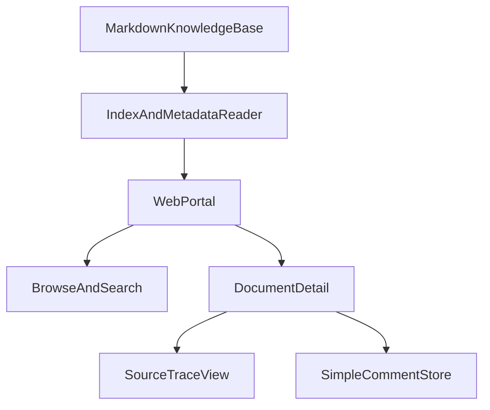

# 知识库前端 MVP 方案

## 推荐方向

- 优先做 `网页端`，暂不先做桌面客户端。原因是当前目标是“所有同事都能用”，网页端部署和迭代成本最低；如果后续确实需要离线或深度本地集成，再用同一前端壳扩展为桌面版。
- 默认采用 `Markdown 知识库目录作为主数据源`，前端不直接改写正文；评论单独存储。这样最贴合当前知识库已有结构，也不会打断现有 Obsidian/脚本工作流。
- 评论先做 `每篇文档下的简单讨论流`，不在第一版引入审批流、@提醒、复杂状态机。

## 现有基础

- 知识库已经有明确分层，适合直接映射成前端导航：`[知识库及前端开发/知识库/README.md](知识库及前端开发/知识库/README.md)`、`[知识库及前端开发/知识库/运行域/治理文档/知识库架构说明.md](知识库及前端开发/知识库/运行域/治理文档/知识库架构说明.md)`
- 元数据规范已经定义了前端最需要的字段：`[知识库及前端开发/知识库/运行域/治理文档/元数据规范.md](知识库及前端开发/知识库/运行域/治理文档/元数据规范.md)`
- 现有自动索引可作为第一版列表页和搜索页的数据来源参考：`[知识库及前端开发/知识库/运行域/治理文档/内容资料索引.md](知识库及前端开发/知识库/运行域/治理文档/内容资料索引.md)`、`[知识库及前端开发/知识库/运行域/同步文档/index.md](知识库及前端开发/知识库/运行域/同步文档/index.md)`
- 当前未发现可复用的前端工程，`前端开发` 目录可视为尚未起步，因此前端需要从 0 到 1 搭建。

## MVP 范围

- 首页/导航页：按四个知识区展示入口，分别是 `知识地图`、`概念原理`、`产品主张`、`策略判断`
- 文档列表页：支持按 `知识区`、`kb_type`、`status`、`owner`、`updated_at` 筛选
- 全局搜索：先做标题、路径、正文关键字搜索；如果后续效果不够，再补全文索引引擎
- 文档详情页：渲染 Markdown 正文，同时展示 frontmatter 字段、来源文档、相关概念/产品、更新时间
- 来源追溯：从正文页跳转到 `source_docs` 指向的来源页或同步文档页
- 简单评论：每篇文档一个评论流，支持发表评论、时间排序、展示作者与时间

## 建议信息架构

## 核心数据模型

- `KnowledgePage`
  - `path`: 文档唯一标识，建议直接使用相对路径
  - `title`: 从一级标题或文件名提取
  - `knowledgeZone`: 从路径解析，映射四个知识区
  - `kb_type`, `status`, `owner`, `updated_at`, `source_docs`, `evidence_level`, `related_products`, `related_concepts`
  - `bodyHtml/bodyMd`: 渲染后的正文
- `Comment`
  - `id`, `pagePath`, `author`, `body`, `createdAt`
  - 第一版不做楼中楼，只做平铺式讨论，避免过早复杂化

## 分阶段实施

### 阶段 1：先把“读”做好

- 建一个读取 Markdown 与 frontmatter 的数据层
- 把 `[知识库及前端开发/知识库/运行域/治理文档/内容资料索引.md](知识库及前端开发/知识库/运行域/治理文档/内容资料索引.md)` 与真实文件树对齐，生成统一文档清单
- 跑通首页、列表页、详情页、来源跳转

### 阶段 2：补“搜”

- 先做轻量全文检索，支持标题/正文/路径匹配
- 搜索结果页显示 `标题 + 摘要 + 知识区 + kb_type + 更新时间`
- 如果命中质量不足，再升级为独立搜索索引，而不是一开始就上复杂基础设施

### 阶段 3：补“评”

- 为每篇文档挂接简单评论流
- 评论与正文解耦，避免写回 Markdown
- 评论页先只支持发布、展示、删除/隐藏基础管理能力

### 阶段 4：再做增强

- 热门文档/最近更新/待完善页面
- 基于 `status` 与 `evidence_level` 的风险提示
- 如果网页端稳定，再考虑封装桌面客户端

## 关键设计原则

- 不打断现有知识生产流程：知识仍沉淀在 `[知识库及前端开发/知识库](知识库及前端开发/知识库)`
- 前端先消费现有规则，不先重造知识模型
- 评论是“协作层”，不是“正文层”
- 先做可用，再做复杂治理和权限细化

## 主要风险与预案

- 元数据覆盖不完整：会影响筛选质量。预案是第一版允许字段缺失，同时把缺失字段显示为“待补”而不是阻塞上线
- 搜索效果不稳定：先做轻量实现，必要时再升级索引方案
- 评论与身份体系未定：第一版先按最简单的公司内部身份展示设计，不把审批流绑进来

## 首批最值得复用的字段

- `knowledgeZone`（从路径推导）
- `kb_type`
- `status`
- `updated_at`
- `owner`
- `source_docs`
- `evidence_level`（仅产品主张类重点展示）

## 计划产出

- 一份前端信息架构和页面清单
- 一套文档数据模型定义
- 一版网页端 MVP 技术方案
- 一份“后续是否扩桌面端”的判断标准

