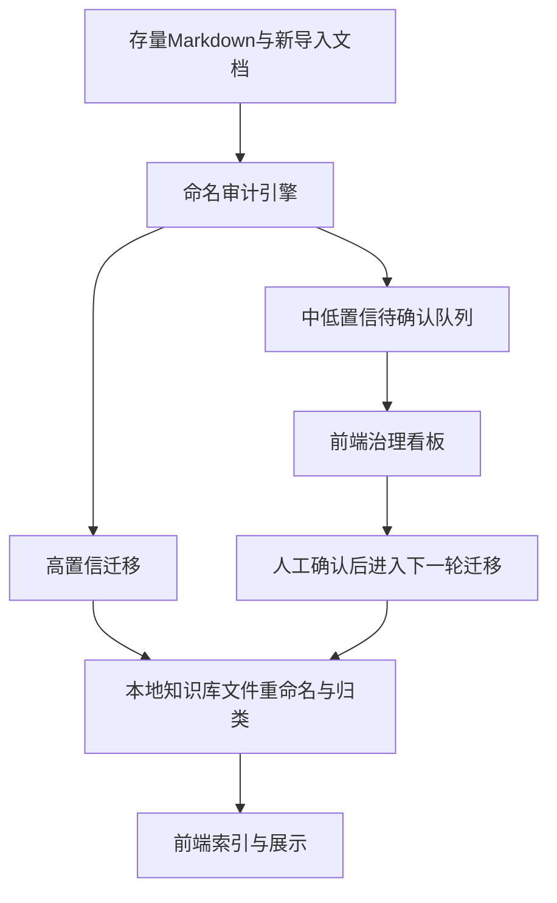

# 知识库命名治理闭环

## 现状判断

当前这套知识库已经有了不错的基础，但还停在“能审计、能展示、能局部迁移”，没有真正闭成环：

- 规则基础已经存在，核心文件包括 [命名与归档规范.md](C:/Users/016551/OneDrive/Desktop/科技树/知识库及前端开发/知识库/运行域/治理文档/命名与归档规范.md)、[元数据规范.md](C:/Users/016551/OneDrive/Desktop/科技树/知识库及前端开发/知识库/运行域/治理文档/元数据规范.md)、[命名治理字典.json](C:/Users/016551/OneDrive/Desktop/科技树/知识库及前端开发/知识库/运行域/治理文档/命名治理字典.json)。
- 执行能力已经存在，核心脚本包括 [kb_naming_rules.py](C:/Users/016551/OneDrive/Desktop/科技树/知识库及前端开发/知识库/运行域/脚本/kb_naming_rules.py)、[audit_kb_naming.py](C:/Users/016551/OneDrive/Desktop/科技树/知识库及前端开发/知识库/运行域/脚本/audit_kb_naming.py)、[apply_kb_naming_migration.py](C:/Users/016551/OneDrive/Desktop/科技树/知识库及前端开发/知识库/运行域/脚本/apply_kb_naming_migration.py)、[sync_binary_docs.py](C:/Users/016551/OneDrive/Desktop/科技树/知识库及前端开发/知识库/运行域/脚本/sync_binary_docs.py)。
- 前端已经能展示治理结果，关键链路在 [kb_backend.py](C:/Users/016551/OneDrive/Desktop/科技树/知识库及前端开发/前端开发/kb_backend.py)、[server.py](C:/Users/016551/OneDrive/Desktop/科技树/知识库及前端开发/前端开发/server.py)、[app.js](C:/Users/016551/OneDrive/Desktop/科技树/知识库及前端开发/前端开发/static/app.js)。
- 真正的短板是闭环缺口：规则还不够稳定、迁移脚本只覆盖一部分场景、前端没有“待确认治理队列”视图、新导入流程没有统一接入命名达标检查。
- 当前审计结果也说明问题集中在元数据缺失、文件名不规范、路径归类偏差和来源追溯不足，见 [kb_naming_audit_latest.md](C:/Users/016551/OneDrive/Desktop/科技树/知识库及前端开发/知识库/运行域/治理文档/审计记录/kb_naming_audit_latest.md)。

## 目标方案

把治理链路统一成下面这条主线：

这套方案里有三个原则：

- `命名治理字典.json` 继续作为机器可读单一规则源，文档规范围绕它收敛，而不是让文档、脚本、前端各有一套口径。
- 本地脚本负责真正改名、迁移、引用更新和审计产出；前端只负责治理可视化、筛选、追踪和人工确认清单查看。
- 新导入文档不再“先脏着入库再补救”，而是在同步或入库时立刻得到标准名、建议路径、达标分和治理状态。

## 分阶段落地

### 阶段 1：先把规则收口成真正可执行的契约

聚焦 [命名治理字典.json](C:/Users/016551/OneDrive/Desktop/科技树/知识库及前端开发/知识库/运行域/治理文档/命名治理字典.json)、[命名与归档规范.md](C:/Users/016551/OneDrive/Desktop/科技树/知识库及前端开发/知识库/运行域/治理文档/命名与归档规范.md)、[元数据规范.md](C:/Users/016551/OneDrive/Desktop/科技树/知识库及前端开发/知识库/运行域/治理文档/元数据规范.md)。

要做的不是再写一份“大而全说明书”，而是补齐规则里最影响自动化的几项：

- 明确哪些文件永远不参加正式知识页命名治理，比如目录说明页、索引页、运行文档页。
- 明确四大知识区下允许的标准子类，以及哪些子类支持“产品线目录”自动推断。
- 把“建议标题生成”和“建议路径生成”拆成独立规则，避免当前一些低质量建议把标题和路径同时带偏。
- 把置信度阈值写进配置，而不是散落在脚本逻辑里，方便以后调策略。

### 阶段 2：升级审计引擎，让建议更稳、结果更可执行

聚焦 [kb_naming_rules.py](C:/Users/016551/OneDrive/Desktop/科技树/知识库及前端开发/知识库/运行域/脚本/kb_naming_rules.py) 和 [audit_kb_naming.py](C:/Users/016551/OneDrive/Desktop/科技树/知识库及前端开发/知识库/运行域/脚本/audit_kb_naming.py)。

重点改进：

- 给 `README.md`、`index.md`、同步索引、治理文档这类特殊文件加例外策略，避免它们被误判成正式知识页待迁移对象。
- 增强标题清洗逻辑，区分“噪音词剔除”和“主题语义保留”，减少把真实主题误删的情况。
- 强化子类推断逻辑，让“产品线目录”“专题项目”“外部研究”“术语卡”这些场景不只靠关键词碰碰运气。
- 让审计输出更适合后续执行：除 `canonicalPath` 外，补充 `recommendedAction`、`reviewReason`、`autoApplyEligible` 之类字段，直接支撑脚本迁移和前端治理看板。

### 阶段 3：把迁移脚本补成真正的治理执行器

聚焦 [apply_kb_naming_migration.py](C:/Users/016551/OneDrive/Desktop/科技树/知识库及前端开发/知识库/运行域/脚本/apply_kb_naming_migration.py)。

默认采用你选定的“平衡策略”：

- 高置信文档自动执行重命名、移动目录、补 frontmatter、更新 `canonical_*` / `original_*` 字段。
- 中置信文档进入待确认清单，不自动改动本地文件。
- 低置信文档保留原位，只输出原因和建议。

这里要补齐的能力：

- 扩展引用重写范围，不只更新 `source_docs` / `supersedes`，还要检查 `canonical_path`、前端依赖路径、以及后续可扩展的引用字段。
- 生成稳定的 `rename_map`、`review_queue`、`skipped`、`rollback_basis` 文件，确保迁移可追溯、可复盘。
- 增加“按目录分批治理”和“只处理新增/变更文档”的能力，避免以后每次都全库大迁移。

### 阶段 4：把新导入流程接入同一套达标机制

聚焦 [sync_binary_docs.py](C:/Users/016551/OneDrive/Desktop/科技树/知识库及前端开发/知识库/运行域/脚本/sync_binary_docs.py) 和 [file_sync_config.json](C:/Users/016551/OneDrive/Desktop/科技树/知识库及前端开发/知识库/file_sync_config.json)。

这一步的目标是让“新文档入库即治理”：

- 二进制同步产物继续在 `运行域/同步文档` 下生成语义化文件名，但生成后立刻跑命名审计。
- 自动生成的 `*_同步版.md` 不只写最小 frontmatter，还要带完整治理字段，确保它在前端和审计里是一级公民。
- 对新进入知识域的 Markdown 文档也复用同一套审计与迁移逻辑，不让规则只服务于 PDF/PPT/DOCX/XLSX 产物。
- 把“高置信自动迁移、中置信入待确认队列”接到同步结束后的默认流水线里。

### 阶段 5：前端补成治理看板，而不是只显示单篇治理分

聚焦 [kb_backend.py](C:/Users/016551/OneDrive/Desktop/科技树/知识库及前端开发/前端开发/kb_backend.py)、[server.py](C:/Users/016551/OneDrive/Desktop/科技树/知识库及前端开发/前端开发/server.py)、[app.js](C:/Users/016551/OneDrive/Desktop/科技树/知识库及前端开发/前端开发/static/app.js)。

按你选的 `dashboard-only` 方向，前端不负责直接改文件，而是补下面几类信息：

- 治理总览：达标率、待确认数量、各知识区问题分布、近期待处理文档。
- 治理队列：按 `namingStatus`、`confidence`、`knowledgeZone`、`kbType`、是否有建议路径变更来筛选。
- 单文档治理视图：当前路径、建议路径、原名、标准名、问题列表、建议动作、来源链。
- 新导入追踪：区分“同步产物已生成但未归档”“已自动达标”“待人工确认”。

后端上建议新增只读 API，例如：治理概览、治理队列、待确认项详情，而不是把这些信息散落在普通文档列表接口里。

### 阶段 6：补一套治理运行 SOP，让以后能持续做下去

聚焦 [治理看板.md](C:/Users/016551/OneDrive/Desktop/科技树/知识库及前端开发/知识库/运行域/治理文档/治理看板.md) 和相关治理文档。

建议把日常运行拆成三种节奏：

- 日常：新导入文档自动审计，自动落高置信项。
- 每周：处理前端看板里的中置信待确认队列。
- 每月：重跑全库审计，更新审计记录和治理看板，观察规则误判与漏判。

## 实施顺序

建议严格按下面顺序推进，不要先做前端页面再补规则：

1. 先固化规则契约与例外清单。
2. 再升级审计结果结构。
3. 再补迁移执行器与引用更新。
4. 然后把新导入流水线接进来。
5. 最后补前端治理看板和只读 API。

这样做的原因是：前端现在读取的是审计结果，如果规则和审计结构没定，前端页面会反复返工。

## 验证方式

交付时建议至少保留三类验证：

- 脚本层：为 [kb_naming_rules.py](C:/Users/016551/OneDrive/Desktop/科技树/知识库及前端开发/知识库/运行域/脚本/kb_naming_rules.py) 和 [apply_kb_naming_migration.py](C:/Users/016551/OneDrive/Desktop/科技树/知识库及前端开发/知识库/运行域/脚本/apply_kb_naming_migration.py) 增加针对“高置信自动迁移 / 中置信进入待确认 / 特殊文件跳过”的用例。
- 后端层：更新 [test_kb_backend.py](C:/Users/016551/OneDrive/Desktop/科技树/知识库及前端开发/前端开发/tests/test_kb_backend.py)，覆盖治理队列字段、建议路径展示和特殊文件过滤。
- 全库层：重跑命名审计，确认 `noncompliant` 数量下降，且不会把 `README`、索引页、治理文档误迁移。

## 本轮最值得改的文件

如果下一步进入执行，我会优先围绕下面这些文件推进：

- [命名治理字典.json](C:/Users/016551/OneDrive/Desktop/科技树/知识库及前端开发/知识库/运行域/治理文档/命名治理字典.json)
- [kb_naming_rules.py](C:/Users/016551/OneDrive/Desktop/科技树/知识库及前端开发/知识库/运行域/脚本/kb_naming_rules.py)
- [audit_kb_naming.py](C:/Users/016551/OneDrive/Desktop/科技树/知识库及前端开发/知识库/运行域/脚本/audit_kb_naming.py)
- [apply_kb_naming_migration.py](C:/Users/016551/OneDrive/Desktop/科技树/知识库及前端开发/知识库/运行域/脚本/apply_kb_naming_migration.py)
- [sync_binary_docs.py](C:/Users/016551/OneDrive/Desktop/科技树/知识库及前端开发/知识库/运行域/脚本/sync_binary_docs.py)
- [kb_backend.py](C:/Users/016551/OneDrive/Desktop/科技树/知识库及前端开发/前端开发/kb_backend.py)
- [server.py](C:/Users/016551/OneDrive/Desktop/科技树/知识库及前端开发/前端开发/server.py)
- [app.js](C:/Users/016551/OneDrive/Desktop/科技树/知识库及前端开发/前端开发/static/app.js)

这会是一条“先把治理底座做对，再把体验补完整”的路线，而不是直接去大规模改文件名。