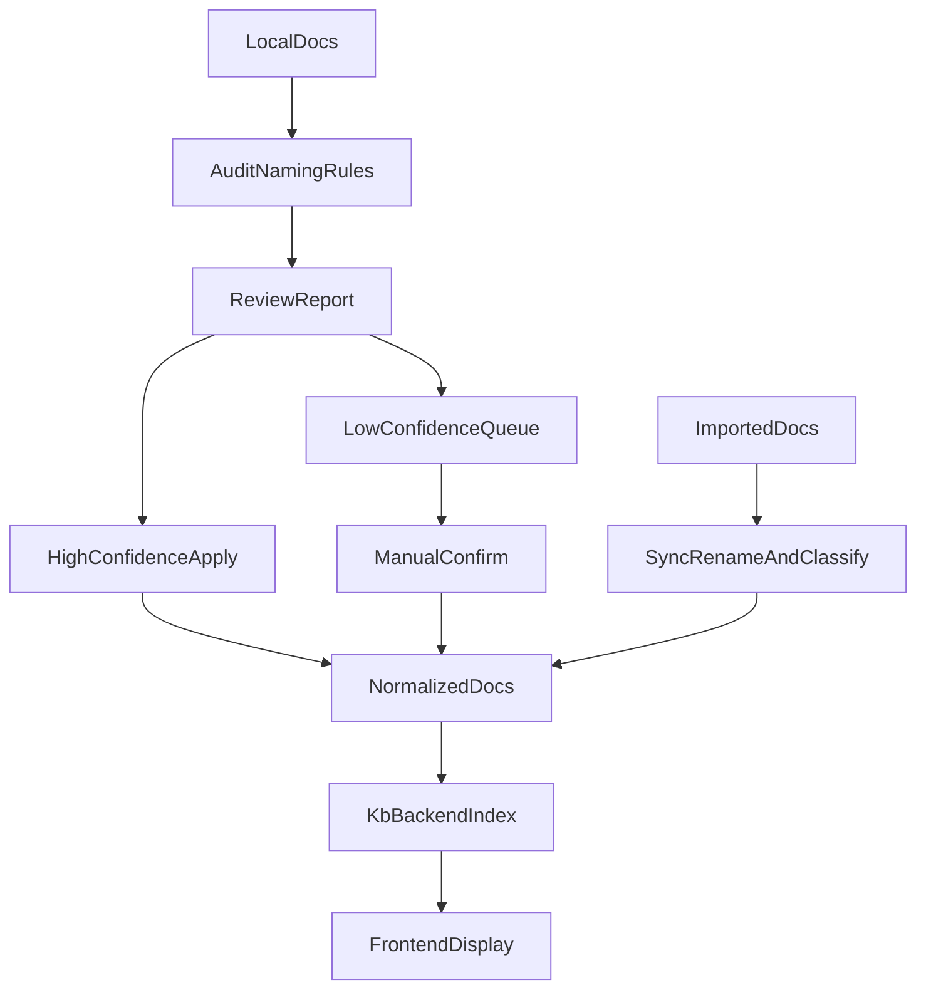

# 知识库命名治理与达标

基于你的选择，方案采用“双轨制”：目录负责知识区与大类归属，frontmatter 负责类型、状态、负责人等治理字段，文件名聚焦“主题可读、对外直观、移动方便”。历史文档采用“先审计、后执行”的治理方式：先生成整改建议清单，再对高置信度项半自动执行，低置信度项进入待确认队列。

## 目标定义

需要同时解决三件事：

- 让本地文档的目录、文件名、frontmatter 形成统一规则。
- 让所有历史文档都能被扫描、评分、建议重命名并重新归类。
- 让新导入文档在进入知识库时自动被命名、归类，并在前端展示统一后的结果与达标状态。

## 现状约束

当前前端和后端强依赖“相对路径 + frontmatter”：

- [知识库及前端开发/前端开发/kb_backend.py](知识库及前端开发/前端开发/kb_backend.py) 会扫描 `知识域/**/*.md` 和 `运行域/同步文档/**/*.md`，并用相对路径派生 `knowledgeZone`、用 frontmatter 提供 `kbType`、`status`、`owner`、`updatedAt`。
- [知识库及前端开发/知识库/运行域/脚本/sync_binary_docs.py](知识库及前端开发/知识库/运行域/脚本/sync_binary_docs.py) 是新导入/同步链路的最佳挂点。
- [知识库及前端开发/知识库/file_sync_config.json](知识库及前端开发/知识库/file_sync_config.json) 已经定义了同步范围。
- [知识库及前端开发/前端开发/static/app.js](知识库及前端开发/前端开发/static/app.js) 直接展示 `title`、`path`、`knowledgeZone`、`kbType` 等字段。

## 方案设计

### 1. 建立统一命名与归类规范

新增一份治理规范文档，作为今后所有脚本和人工整理的唯一标准源，建议落在：

- [知识库及前端开发/知识库/运行域/治理文档/元数据规范.md](知识库及前端开发/知识库/运行域/治理文档/元数据规范.md)
- 或新增与其并列的 `命名与归档规范.md`

规范中明确以下内容：

- 目录规则：`知识域/<知识区>/<子类>/<标准文件名>.md`
- 文件名模板：`主题名` 为主，不把状态、临时词、同步痕迹写进文件名；必要时允许少量稳定前缀，如系列序号
- 禁止项：`加工中`、`建设中`、`待锁定`、`(2)`、hash 尾缀、`document.md`、`cleaned.md` 这类无语义文件名
- 保留字段：新增 `original_title`、`original_path`、`canonical_title`、`canonical_path` 或等价字段，保证溯源
- 分类字典：知识区、文档类型 `kb_type`、系列规则、产品线归类词表、常见别名映射
- 达标标准：至少覆盖“命名达标、路径达标、元数据达标、归类达标、来源达标”五个维度

### 2. 建立全库审计与建议重命名器

在 [知识库及前端开发/知识库/运行域/脚本/](知识库及前端开发/知识库/运行域/脚本/) 下新增一个只读审计脚本，例如 `audit_kb_naming.py`，扫描范围与 [知识库及前端开发/前端开发/kb_backend.py](知识库及前端开发/前端开发/kb_backend.py) 保持一致。

这个脚本输出三类结果：

- 达标评分：每篇文档的达标/不达标项
- 建议结果：建议文件名、建议目录、建议 `kb_type`、建议标题
- 置信度分层：高置信度可自动执行，中低置信度进入人工确认

建议规则优先级：

1. frontmatter 标题和类型
2. 首个 Markdown H1
3. 所在目录语义
4. 关键词词典和产品线词典
5. 原文件名中的稳定信息（如产品名、系列编号）

建议输出为机器可执行的清单，如 `json` 或 `csv`，供下一步迁移脚本消费。

### 3. 建立历史文档整改执行器

在同一脚本目录新增迁移执行器，例如 `apply_kb_naming_migration.py`，消费上一步的审计清单。

执行策略按你选的“B+C”设计：

- 第一轮只生成整改清单和预览报告
- 第二轮对高置信度项自动执行：移动目录、重命名文件、补全 frontmatter、记录原名
- 低置信度项输出到“待确认队列”，例如 `待确认归类清单.json`

迁移时需要保证：

- `source_docs` 链接同步更新
- 如果某篇文档被前端以 `path` 引用，索引层能识别新路径
- 生成一份 rename map，保留旧路径到新路径的映射，便于回溯和排障

### 4. 把规则接入新文档导入链路

在 [知识库及前端开发/知识库/运行域/脚本/sync_binary_docs.py](知识库及前端开发/知识库/运行域/脚本/sync_binary_docs.py) 中接入“命名与归类 hook”，使所有新导入文档在落盘前或落盘后立刻完成：

- 规范化文件名
- 目标目录判定
- frontmatter 补全
- 原名与原路径保留
- 达标状态写入

必要时配合 [知识库及前端开发/知识库/file_sync_config.json](知识库及前端开发/知识库/file_sync_config.json) 增加可配置项，例如：

- 默认知识区映射
- 产品线关键词词典路径
- 命名模板开关
- 是否自动执行重命名

这样以后新导入文档不再先以 `document.md`、`cleaned.md` 等无语义名字进入知识库，再靠人工补救。

### 5. 同步后端索引与前端展示

在 [知识库及前端开发/前端开发/kb_backend.py](知识库及前端开发/前端开发/kb_backend.py) 中扩展索引字段，让前端能拿到统一后的治理信息，例如：

- `canonicalTitle`
- `canonicalPath`
- `namingStatus`
- `complianceScore`
- `originalTitle`

然后在 [知识库及前端开发/前端开发/static/app.js](知识库及前端开发/前端开发/static/app.js) 和 [知识库及前端开发/前端开发/static/app.css](知识库及前端开发/前端开发/static/app.css) 中同步展示：

- 列表和详情默认展示标准名
- 低达标文档显示“待整理/待确认”标记
- 可选展示“原名”作为辅助信息，避免用户找不到旧文件

这样前端就不只是“看到旧名字”，而是直接反映知识库治理后的标准结果。

## 推荐的数据流

## 实施顺序

1. 先定规范与分类字典，避免脚本先写死错误规则。
2. 先做审计器，再做执行器，避免一上来批量误改历史文档。
3. 再接入导入链路，保证今后新增文档不再继续污染命名体系。
4. 最后扩展后端字段和前端展示，让“达标状态”可见。

## 风险与控制

- 历史文档标题本身质量不高：通过 `original_title` 与待确认队列兜底。
- 批量重命名影响 `source_docs` 和旧引用：通过 rename map 统一修复。
- 分类词典初版不准：先高置信度自动执行，低置信度人工确认。
- 前端直接依赖路径：治理时优先保证后端索引和来源链同步更新。

