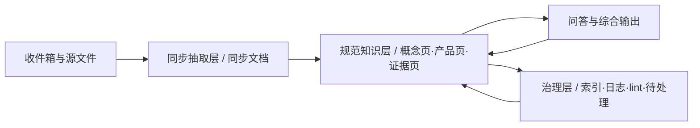

# 科技树知识库治理升级计划

## 现状判断

这个库已经具备很好的“入库”和“可读”基础：`[科技树/知识库/README.md](科技树/知识库/README.md)` 已经把 `收件箱 -> 同步文档 -> 分库 MD -> 索引/log/lint` 的骨架搭起来了，`[科技树/知识库/同步文档/README.md](科技树/知识库/同步文档/README.md)` 明确了原始抽取层和标准入口的分离，`[科技树/知识库/脚本/lint_kb_prompt.md](科技树/知识库/脚本/lint_kb_prompt.md)` 也已经有了数值冲突、FABE 背书、孤岛文件、命名违规的健康检查思路。

但目前它管理的主要还是“文件”，不是“知识对象”。现有规则里最有价值的三条其实已经把方向说对了：`一个事实只有一个出处`、`FABE 卖点必须有技术背书`、`结论值得回写就回写`（见 `[科技树/知识库/README.md](科技树/知识库/README.md)` 与 `[科技树/知识库/文档/项目指导文档.md](科技树/知识库/文档/项目指导文档.md)`）。真正缺的是把这些原则落成日常闭环：概念页、证据链、冲突处理、时效标记、责任人、问答回写。

## 默认策略

默认采用“轻量治理升级”而不是直接上数据库/知识图谱：保留现有四大分库和 `同步文档/` 结构，先把 Markdown 页面的类型、元数据、健康检查和回写机制补齐。等页数、来源数和检索复杂度明显上升后，再考虑 BM25 / 向量 / 图谱作为派生层，而不是替代当前 Markdown 主体。

## 目标架构

核心变化不是“多一个搜索入口”，而是新增一层 **规范知识层**：把原始资料编译成可维护的概念页、产品页、卖点证据页和专题综合页，并让治理层持续检查这些页面是否还可信、还新鲜、还能互相引用。

## 分阶段方案

### 第一阶段：从“文件库”升级为“类型化知识库”

优先修改 `[科技树/知识库/README.md](科技树/知识库/README.md)` 与 `[科技树/知识库/文档/项目指导文档.md](科技树/知识库/文档/项目指导文档.md)`，把当前按目录分类的规则，升级为“目录 + 页面类型”的双层规则。

建议先定义 4 类核心页面：

- `source_summary`：来源摘要页，对应一份源文档或同步文档入口。
- `concept`：概念/术语页，例如某项声学机制、材料、结构、算法。
- `product_claim`：产品卖点/主张页，要求显式链接到技术背书。
- `decision`：综合判断/方法论/对比结论页，用来承接高价值问答回写。

建议新增 `[科技树/知识库/文档/元数据规范.md](科技树/知识库/文档/元数据规范.md)`，统一 YAML frontmatter 字段，例如：

- `kb_type`
- `status`（`draft` / `review` / `published` / `deprecated`）
- `owner`
- `updated_at`
- `source_docs`
- `evidence_level`
- `supersedes`
- `related_products`
- `related_concepts`

默认不新增一级目录；只在现有目录内增加少量二级结构或模板，例如 `技术/术语卡/`、`产品/卖点卡/`、`文档/模板/`，避免一上来做大重构。

### 第二阶段：把治理动作接入日常工作流

在 `[科技树/知识库/文档/项目指导文档.md](科技树/知识库/文档/项目指导文档.md)` 的存入/维护流程中，明确“每新增一个来源，至少要触发哪几种知识更新”。

默认新增来源后的标准动作应为：

1. 生成或更新 `source_summary`。
2. 更新受影响的 `concept` 页。
3. 更新受影响的 `product_claim` 页，并补充证据链。
4. 如出现冲突、低置信度或待确认数字，写入待处理清单。
5. 追加一条 `log.md` 记录，说明这次知识变更触及了哪些规范页。

建议新增 `[科技树/知识库/文档/治理看板.md](科技树/知识库/文档/治理看板.md)` 或 `文档/review_queue.md`，专门承接：

- 数值冲突待定
- 背书缺失待补
- 过时页面待更新
- 概念缺页待建
- 重复版本待定性

这样 `log.md` 继续做时间线，`内容资料索引.md` 继续做内容目录，新的治理看板负责“未闭环事项”。

### 第三阶段：把“问答”变成“沉淀”

当前最可惜的是，很多高价值判断可能仍然沉在聊天里。`[科技树/知识库/文档/项目指导文档.md](科技树/知识库/文档/项目指导文档.md)` 已经写了“结论值得回写就回写”，这一条应该升级成固定 SOP。

建议明确回写规则：

- 跨文档综合判断，回写到 `规划/` 或 `竞品/对比研究/`。
- 稳定技术解释，回写到 `技术/` 的概念页或专题页。
- 已验证的产品卖点表述，回写到 `产品/` 的卖点页或同步版主文档。
- 仅供核查的抽取结果，仍停留在 `同步文档/`，不直接当知识结论。

这样 AI 的角色就从“搜索员”升级为“编目员 + 维护员 + 起草员”，而不是每次临时把资料拼起来回答。

### 第四阶段：把 lint 从“发现问题”升级为“健康运营”

当前 `[科技树/知识库/脚本/lint_kb_prompt.md](科技树/知识库/脚本/lint_kb_prompt.md)` 已经很好，但更像一次性检查。建议扩成治理仪表盘，除现有四项外，再增加：

- 页面是否缺少 `owner` / `updated_at`
- 结论页是否缺少 `source_docs`
- 过时页面是否被 `supersedes` 串起来
- 反复出现的术语是否已有 `concept` 页
- `product_claim` 是否明确链接到技术背书
- 哪些页面最近 90 天被频繁引用但没有更新

现有 `[科技树/知识库/文档/内容资料索引.md](科技树/知识库/文档/内容资料索引.md)` 已经有“结构性问题”“内容缺口”的手工区，这非常适合继续保留，并逐步转成月度/季度治理输出的固定汇总区。

### 第五阶段：检索升级，但只作为派生层

参考 Karpathy 的 gist、`obsidian-llm-wiki-local` 和 `nashsu/llm_wiki` 一类实现，当前最值得吸收的不是“马上上图谱”，而是：

- 选择性重编译，而不是全库重写
- 源文档可追溯，而不是只留 AI 摘要
- 手工改过的页面要保护，不被自动覆盖
- 自动发现知识缺口和孤岛页
- 把 query 输出写回 wiki，而不是留在聊天记录里

等知识页数量明显上升、`index.md` / `内容资料索引.md` 变得过大时，再评估：

- Obsidian Dataview 视图
- BM25 / 本地搜索
- 向量检索
- 轻量知识图谱

这一步应建立在“人定义页面类型与元数据、LLM只做增补和维护”的前提上，而不是让 LLM 直接生成一堆无法验证的长摘要替代原文。

## 外部实践如何映射到你的库

- Karpathy 的 `llm-wiki` 适合你吸收的核心不是“问答更强”，而是“把知识编译成持久 wiki，并持续维护”。你库里的 `同步文档/` 和分库 MD 已经很接近这个基础形态。
- `obsidian-llm-wiki-local` 值得借鉴的是：来源可追溯、选择性更新、健康检查、手工编辑保护、自动 watch 流程。
- `nashsu/llm_wiki` 值得借鉴的是：`purpose.md`（为什么这个库存在）、review queue、知识缺口检测、图谱只做派生能力。
- BlueSpice 这类企业 wiki 的启发是：内容策略、信息架构、质量管理必须拆开设计。你现在已经有信息架构雏形，下一步最缺的是质量管理和内容生命周期。

## 建议优先动的文件

- `[科技树/知识库/README.md](科技树/知识库/README.md)`：把“知识对象类型”和“默认治理流程”写进总入口。
- `[科技树/知识库/文档/项目指导文档.md](科技树/知识库/文档/项目指导文档.md)`：把 ingest / writeback / lint / review queue 的职责固定下来。
- `[科技树/知识库/脚本/lint_kb_prompt.md](科技树/知识库/脚本/lint_kb_prompt.md)`：从“月度检查”升级为“健康运营清单”。
- `[科技树/知识库/文档/内容资料索引.md](科技树/知识库/文档/内容资料索引.md)`：保留目录功能，但逐步补入页面类型、状态、owner、更新时间等轻量元数据。
- `[科技树/知识库/文档/log.md](科技树/知识库/文档/log.md)`：继续保持 append-only，但让它记录“知识变更”而不只是文件动作。
- 新增 `[科技树/知识库/文档/元数据规范.md](科技树/知识库/文档/元数据规范.md)` 与 `[科技树/知识库/文档/治理看板.md](科技树/知识库/文档/治理看板.md)`，作为治理规则与未闭环事项的中枢。

## 成功标准

- 新来源进入后，不只是多一个 `document.md` 或 `*_同步版.md`，而是会自动带动概念页、卖点页或综合页更新。
- 对外话术能追到技术背书；冲突数字能被显式标记；过时结论能被替代链串起来。
- 高价值问答不再沉没在聊天里，而是稳定回写进四大分库之一。
- 维护者看的不只是“有哪些文件”，还看得到“哪些知识对象缺证据、缺更新、缺负责人、缺连接”。

