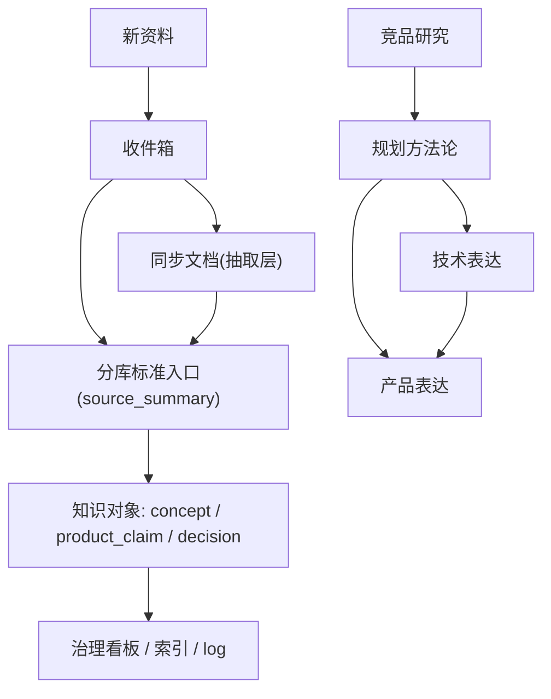

# 知识库重构蓝图

## 核心判断

- 当前复杂度不是单纯“文件变多”，而是**两套维度混在一个目录树里**：
  - 知识域：`[知识库/规划/](知识库/规划/README.md)` / `[知识库/技术/](知识库/技术/README.md)` / `[知识库/产品/](知识库/产品/README.md)` / `[知识库/竞品/](知识库/竞品/README.md)`
  - 运行层：`[知识库/收件箱/](知识库/收件箱/README.md)` / `[知识库/同步文档/](知识库/同步文档/README.md)` / `[知识库/文档/](知识库/文档/项目指导文档.md)` / `[知识库/脚本/](知识库/脚本/README.md)`
- 当前规则文件已经说明了一个完整系统：`收件箱 -> 同步抽取 -> 分库标准入口(source_summary) -> 知识对象(concept/product_claim/decision) -> 治理看板/索引/log`，但这些规则分散在 `[知识库/README.md](知识库/README.md)`、`[知识库/文档/项目指导文档.md](知识库/文档/项目指导文档.md)`、`[知识库/文档/元数据规范.md](知识库/文档/元数据规范.md)` 里，没有被浓缩成一张人人看得懂的“目录契约图”。
- 默认重构方向：**保留四大内容分库，不新增更多业务一级分类；把其余目录明确为流程层，不再与内容层争夺语义。**

## 目标结构

- `[知识库/README.md](知识库/README.md)`：只回答“这是什么库、怎么进、怎么找、怎么放”。
- 新建一份单一真相文档（建议放在 `知识库/文档/` 下），专门定义：
  - 每个一级/二级文件夹的职责
  - 可放文件格式
  - 可放内容类型
  - 上游输入与下游输出
  - 典型示例
- 保留页面类型作为第二层治理维度：`source_summary` / `concept` / `product_claim` / `decision`，继续以 `[知识库/文档/元数据规范.md](知识库/文档/元数据规范.md)` 为准。
- 所有分库 README 统一成同一模板：`这里放什么 / 不放什么 / 上游是谁 / 下游是谁 / 命名规范 / 常见误放`。

## 目标工作流

## 实施分阶段

### 阶段 1：固化“当前真实逻辑”

- 以 `[知识库/README.md](知识库/README.md)`、`[知识库/文档/项目指导文档.md](知识库/文档/项目指导文档.md)`、`[知识库/文档/元数据规范.md](知识库/文档/元数据规范.md)`、`[知识库/同步文档/README.md](知识库/同步文档/README.md)` 为依据，整理出一份“知识库工作逻辑 + 文件夹职责 + 上下游关系”的统一说明。
- 明确一句话定义：这是一个**内容知识域 × 内容生命周期**的双维知识库，而不是单纯文件夹集合。

### 阶段 2：重写目录契约

- 统一重写这些入口文档，使它们不再重复堆规则，而是各司其职：
  - `[知识库/README.md](知识库/README.md)`
  - `[知识库/文档/项目指导文档.md](知识库/文档/项目指导文档.md)`
  - `[知识库/技术/README.md](知识库/技术/README.md)`
  - `[知识库/产品/README.md](知识库/产品/README.md)`
  - `[知识库/规划/README.md](知识库/规划/README.md)`
  - `[知识库/竞品/README.md](知识库/竞品/README.md)`
  - `[知识库/同步文档/README.md](知识库/同步文档/README.md)`
  - `[知识库/收件箱/README.md](知识库/收件箱/README.md)`
- 把“工作流、目录职责、页面类型、治理规则”拆开写，避免同一句话在多个文档里反复出现。

### 阶段 3：处理最混乱的三个热点区域

- `[知识库/技术/科技树总览/](知识库/技术/README.md)`：明确哪些是总览正文、哪些是同步入口、哪些只是 Excel 拆页镜像。
- `[知识库/产品/2026下半年舒适/](知识库/产品/README.md)`：明确它是“专题项目文件夹”还是“产品线文件夹”，并为多版本 FABE 命名加后缀规则。
- `[知识库/技术/NT-开放式技术学习/对内学习/](知识库/技术/README.md)`：清理“主版 / 留一份 / 培训版 / 技术版”这类命名歧义，必要时只重命名不合并。

### 阶段 4：补齐最小治理闭环

- 用 `[知识库/文档/治理看板.md](知识库/文档/治理看板.md)` 承接“重复版本待定性、概念缺页、卖点缺证据”的未闭环项。
- 用 `[知识库/文档/log.md](知识库/文档/log.md)` 记录重构动作。
- 暂不追求一次性给全库补齐 frontmatter，只要求新增/高频页符合 `[知识库/文档/元数据规范.md](知识库/文档/元数据规范.md)` 的最小字段。

## 这次执行的边界

- 不做全库一次性大迁移。
- 不先动内容正文，先动“入口说明、目录契约、命名规则、少量高混乱目录”。
- 对于已被证明“内容不同但主题相近”的双份文件，优先**重命名定性**，不急着合并或删除；依据见 `[知识库/文档/疑似重复文件_处置报告.md](知识库/文档/疑似重复文件_处置报告.md)`。

