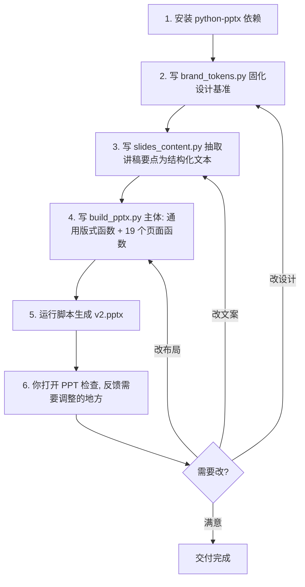

## 一、方案路线：为什么不走 ppt-agent SKILL 默认链路

`ppt-agent` SKILL 的核心交付物是 **HTML 切图 → 拼装成图片 pptx**——成品视觉上很美，但每一页都是一张图，**进入 PowerPoint 后无法二次编辑文字**。这与你"方便后续自己改"的核心诉求相冲突。

因此本方案**主动放弃 SKILL 默认链路**，改为：

- **借用 SKILL 的方法论**（采访已完成、brand-spec 已成型、双线主轴已确认、密度合同思想保留）
- **替换交付引擎**为 [python-pptx](https://python-pptx.readthedocs.io/)，直接生成原生 .pptx
- 每一页的文本框、形状、颜色、字体均为 PowerPoint 原生对象，可在 PPT 里逐字逐色修改

代价：视觉自由度低于 HTML，无法做复杂排版（如不规则裁切、渐变背景、图层叠加）。但这恰好匹配你"克制、不堆字、不要动效、留自由发挥空间"的偏好。

## 二、设计基准（直接锁死，不再讨论）

来源：`[brand-spec.md](C:/Users/016551/OneDrive/Desktop/个人信息相关/转正答辩/brand-spec.md)`

- **尺寸**：16:9，1920×1080 px
- **配色**：白底为主、深色页交替；正文 `#050505` / 次级 `#666666` / 分割线 `#BABABA` / 卡片浅底 `#F1F1F1` / 强调色 `#FF7A3D`（每页 ≤3 处）
- **字体**：中文 Noto Sans SC，西文 Noto Sans，元数据 Consolas；**全 sans，零衬线，零斜体**
- **字号阶梯**：标题 ≤72pt，正文 16-20pt，元数据 12pt；行距按 brand-spec §3.3 表
- **栅格**：12 列网格，左右边距 96px，上下 54px
- **页眉**：每页用 Consolas 小字标 `Shokz 韶音 · 转正答辩 · 曾子逸` + 页码（不当 logo 用）
- **零装饰**：不引入图标库、不画流程图、不放产品图——v1 全文本+少量分隔线

## 三、页面骨架（19 页，跟讲稿节奏走，单页低密度）

按你的"不堆字"原则，把 25 分钟讲稿拆成 19 页，平均每页 ~80 秒口播：

- **封面 (1)**：标题、副标题、答辩人、日期
- **总览 (1)**：双线主轴示意（A 线学业务 × B 线 AI 改业务，纯文字两栏）
- **第 0 章 开场 (1)**：两件事预告
- **第 1 章 自我介绍 (3)**：1.1 个人简介、1.2 跨界迁移逻辑、1.3 性格自评（DISC+MBTI 优势/短板）
- **第 2 章 工作汇报 (8)**：
  - 2.0 岗位认知（PMKT 三句话）— 1 页
  - 2.1 试用期目标全景表 — 1 页（精简到 7 行表格）
  - 2.2 案例①月银白 SOP — 2 页（S/T/A 一页 + R/复盘+双线回扣 一页）
  - 2.3 案例②差异探照灯 — 2 页（同上）
  - 2.4 案例③ PMKT 术语库 — 1 页（短版，单页搞定）
  - 2.5 未来规划 — 1 页（4 行表）
- **第 3 章 文化体验 (3)**：3.1 心路历程（三件交织的事）、3.2 自由与责任、3.3 双百
- **第 4 章 收获致谢 (2)**：4.1 三个变化、4.2 致谢 + 收尾承诺

总计 **19 页**。如果某些 STAR 案例你觉得 2 页拥挤，后续可以拆 3 页；这个是你后续手动调整的空间。

## 四、关键产物

工作目录：`C:\Users\016551\OneDrive\Desktop\个人信息相关\转正答辩\`

新建文件：

- `[build_pptx.py](C:/Users/016551/OneDrive/Desktop/个人信息相关/转正答辩/build_pptx.py)` — 一个独立的 Python 生成脚本，每个函数对应一页（如 `slide_01_cover`、`slide_07_case1_sta`），方便你后续看代码就知道改哪里
- `[slides_content.py](C:/Users/016551/OneDrive/Desktop/个人信息相关/转正答辩/slides_content.py)` — 把所有页面文本抽出成 Python 字典/常量，**改文案不用动布局代码**
- `[brand_tokens.py](C:/Users/016551/OneDrive/Desktop/个人信息相关/转正答辩/brand_tokens.py)` — 把 brand-spec 的颜色、字体、字号、栅格全部固化成常量（如 `SHOKZ_ORANGE = RGBColor(0xFF, 0x7A, 0x3D)`），全局复用
- `[转正答辩_v2.pptx](C:/Users/016551/OneDrive/Desktop/个人信息相关/转正答辩/转正答辩_v2.pptx)` — 最终交付物

## 五、执行步骤（按顺序）

每一步执行完都会暂停让你检查，特别是第 5 步生成首版后，**你必须先打开 .pptx 看一眼整体观感**，不满意我们就回到第 2/3/4 步迭代。

## 六、本方案明确不做的事（与你的约束对齐）

- 不画流程图（你说后续再加）
- 不加任何动效/转场
- 不嵌入 Shokz logo 图片（brand-spec §4.5 明确禁止用非官方矢量）
- 不生成 HTML 版本（你只要 pptx）
- 不调用 ppt-agent SKILL 的任何 subagent（默认链路与诉求冲突）
- 不放占位图、不放装饰性图标（v1 全文本+分割线，零装饰）

## 七、风险与应对

- **字体可用性**：脚本里指定 `Noto Sans SC` 和 `Noto Sans`，但生成时只是写入字体名称，**最终渲染依赖你电脑装的字体**。brand-spec §3.4 已确认你电脑装了这些字体，应无问题；万一某页字体显示异常，fallback 到微软雅黑。
- **表格美化局限**：python-pptx 的原生 table 样式不如 HTML 精致。试用期目标全景表会简化为 7 行的极简表格，宁缺毋滥。
- **首版必有需要改的地方**：行距/留白/字号是品牌手册"对"，但放进 16:9 看可能仍需要肉眼微调。预留 1-2 轮迭代。

