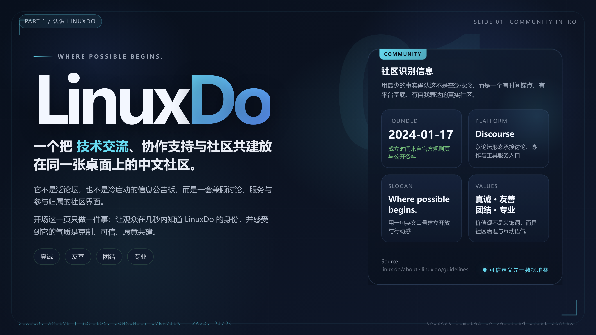
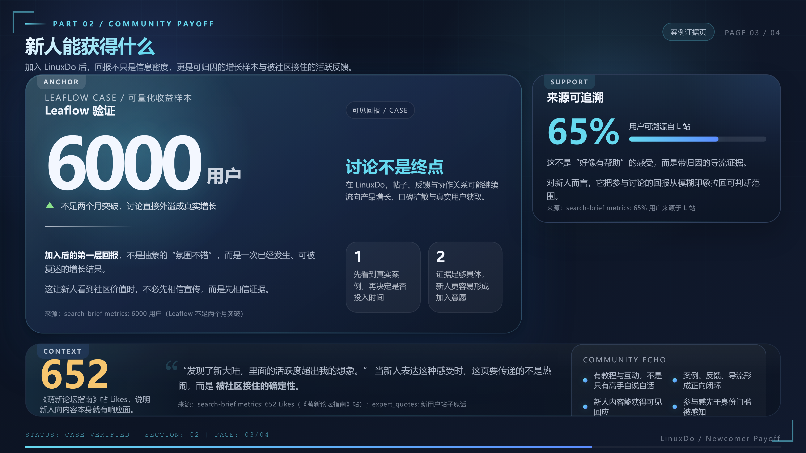

<div align="center">
  
  <h1>PPT Agent</h1>
  <p>Software-engineered, multi-agent pipeline for professional presentation generation</p>
  <p>English | <a href="README.md">中文</a></p>

  <p>
    <a href="#quick-start"></a>
    <a href="LICENSE"></a>
  </p>

  <p>
    
    
    
    
    
    
  </p>
</div>

---

**PPT Agent** is a strict state-machine-driven multi-agent framework that converts a single prompt into a professional PPTX file—eliminating the hallucinations, visual overlaps, and layout instability common in direct LLM generation.

## Latest Update

`2026-04-09 · v4.1`

- Added explicit density contracts across Step 3 `density_bias` and Step 4 `density_label / density_contract`, turning slide density into a validated budget instead of a loose prompt preference.
- Upgraded `visual_qa.py` with dual checks against both `planning` and `html`, so the gate now validates structure and decoration budget in addition to screenshot review.
- Added `subagent_logger.py` to persist PageAgent / PagePatchAgent stage commands and runtime logs, making replay and audit of repair loops much easier.

## Highlights

**Phase-isolated subagent orchestration**: Research, Outline, Style, and Planning each run in fully independent subagent contexts. Cross-phase context contamination is architecturally impossible. Every subagent is created with an explicit `SUBAGENT_MODEL` parameter; default model fallback is prohibited.

**Pixel-sensitive Visual QA loop**: After each slide's HTML is built, a low-resolution screenshot is passed back to the model for visual audit. Layout collisions trigger DOM restructuring and CSS rewrites—not margin adjustments.

**Stateless checkpoint recovery**: No progress state files. After any interruption, the system infers its exact resume point by scanning committed artifact files (`outline.txt`, `style.json`, `slide-N.png`, etc.) on disk.

**Data-render boundary isolation**: Every slide produces a structured JSON contract, validated by `planning_validator.py` before entering the HTML render step. Generated static files are strictly guarded by `html` physical structure detectors to block non-standard skeletons.

**Yin-Yang Demarcation Philosophy**: A pioneering approach that enforces absolute physical firewalls and baseline grid alignment (the Yin), while granting AI models total supremacy over typography, overlap depth, and negative spaces (the Yang)—crushing the mediocre "Word document" look.

**Zero-delay rasterization engine**: The built-in Puppeteer engine fully eliminates hardcoded timeouts, hooking directly into event-driven signals (`document.fonts.ready` and global node listeners). This achieves lightning-fast snapshotting and native SVG parsing with zero dropped fonts or wasted waiting periods.

**Dual-engine PPTX export**: A PNG rasterization pipeline guarantees cross-platform visual fidelity; an SVG vector pipeline preserves text editability for post-delivery modifications.

## Pipeline

```
P0 Interview  →  P1 Branch Routing
P2A Web Search / P2B Local Material Compression
P3 Narrative Outline  →  P3.5 Global Style Contract
P4 Per-slide Parallel Production (Planning → HTML → Visual QA)
P5 Preview Generation + Dual PPTX Export
```

Each stage commits its artifact to disk and passes a Gate validator before the next stage begins. Failures roll back only the current step.

## Artifact Chain

```
interview-qa.txt → requirements-interview.txt
  → search.txt + search-brief.txt | source-brief.txt
  → outline.txt → style.json
  → planningN.json → slide-N.html → slide-N.png
  → preview.html → presentation-{png,svg}.pptx → delivery-manifest.json
```

## Showcase

<details>
  <summary>Click to expand rendered output samples</summary>
  <div align="center">
    <br/>
    
    
    
    
  </div>
</details>

## Quick Start

PPT Agent runs as a native **Agent Skill**—no separate deployment required. Trigger the full pipeline by describing your presentation in any Skill-enabled agent environment:

> *"Generate a 15-page pitch deck on embodied AI trends in 2026. Use a dark tech theme."*

All outputs are written to `ppt-output/runs/<RUN_ID>/`, including a browser-previewable HTML gallery and both PPTX formats.

## Repository Layout

```
ppt-agent-skill/
├── SKILL.md          # Control console: state machine, Gates, recovery rules
├── scripts/          # Runtime scripts (validator / harness / exporter)
├── references/       # On-demand markdown knowledge sources
│   ├── playbooks/    # Phase-specific subagent execution guides
│   ├── styles/       # Theme style specifications
│   ├── layouts/      # Layout resources
│   ├── charts/       # Chart templates
│   └── blocks/       # UI component library
└── assets/
```

## Links

Recognized by and linked to the [LINUX DO Community](https://linux.do).

## License

[MIT](LICENSE)
